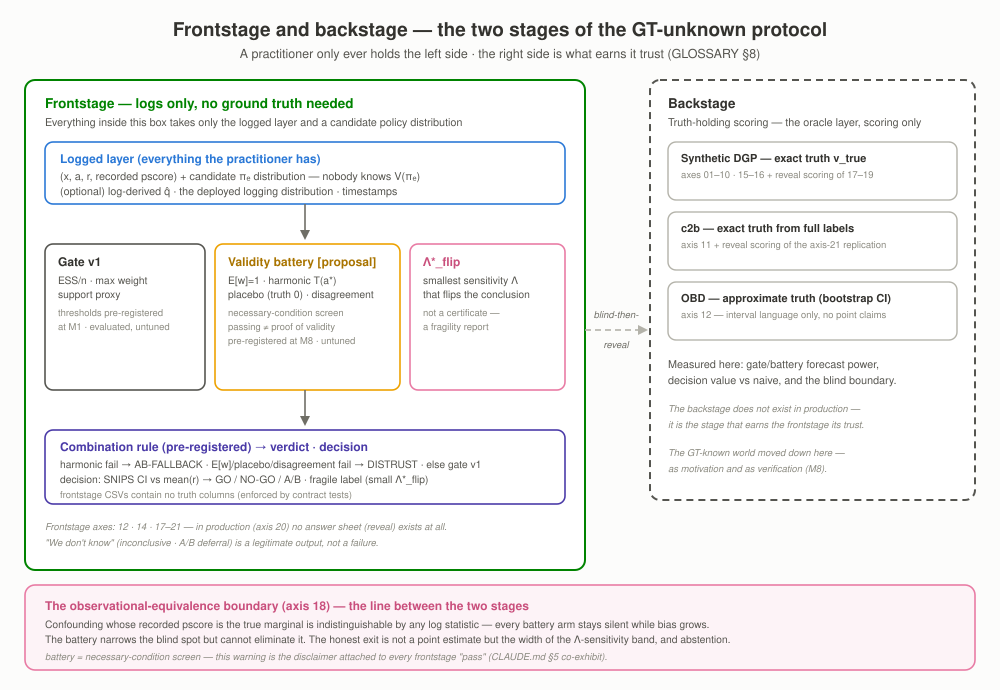

# ope-to-decision

**From logged bandit feedback to deployment decisions — without ever seeing the truth.**

> **All you have is a log and a candidate policy — in practice, nobody knows the true value
> $V(\pi_e)$. A multi-action OPE protocol + benchmark that rules "trust / distrust / send it
> to A/B" from log-computable signals alone, and scores those signals' forecasting power and
> blind spots on a backstage where the truth is known.**

[🇰🇷 한국어 (canonical)](README.md) · **🇺🇸 English**


-4a3aa7)


---

## ⏱️ TL;DR — 30 seconds

- **Problem.** You want to know what a new recommendation policy is worth before it touches
  traffic. A/B slots are scarce and a bad policy burns revenue and UX — yet the logs you have
  only recorded the actions the *old* policy chose. This is precisely the motivation Spotify laid
  out at WSDM'19 ([paper](https://research.atspotify.com/publications/offline-evaluation-to-make-decisions-about-playlistrecommendation-algorithms)).
  And there is one more problem — the real one: **in practice, nobody knows the true value
  $V(\pi_e)$.** In a world where no one will ever grade your estimate, what can you compute,
  and when must you stop?
- **Approach.** We assembled the signals computable from logs alone into a pre-registered
  protocol — three diagnostics (ESS · max-weight · support) → a 3-way gate, a **validity
  battery** (E[w] · harmonic calibration · placebo · disagreement — a necessary-condition
  screen), and the Λ\* sensitivity certificate. Whether these signals actually forecast errors,
  and **where they are blind in principle**, was scored blind-then-reveal on a backstage that
  knows the truth (synthetic DGP · UCI c2b · OBD approximate GT). The seven estimators are our
  own numpy implementations, adversarially cross-validated against obp/sb-obp.
- **Three headline results.**
  1. **On a real log, the protocol stops itself** — judging the ZOZO production log from the
     log alone: gate distrust + a battery harmonic firing (recorded propensities inconsistent
     with empirical action frequencies) → **AB_FALLBACK**, fragile at Λ\*_flip 1.34. No
     ground-truth answer sheet exists — this is what practice looks like (LEDGER `m8-20-card`).
  2. **The protocol's decision value is quantified** — on a contaminated log (propensity
     noise), naive IPS point estimation green-lights a genuinely bad candidate with
     **false-go 0.9** (mean regret 0.21); the protocol's rate is **0.0** (the battery fires →
     back to A/B). On healthy logs it stays decisive: go 0.95 on the good candidate, no-go 0.9
     on the bad one, zero errors (LEDGER `m8-19-decision-value`).
  3. **The boundary of what it cannot see is mapped too** — the battery catches misrecording
     and support deficiency (the axis-17 detection matrix), but confounding whose record stays
     marginally calibrated is **indistinguishable by any log statistic**: 0/240 detection-arm firings per recording mode while
     the bias grows to −0.073 (axis 18, LEDGER `m8-18-boundary`) — the exit is a Λ-sensitivity
     interval, not a point estimate.
- **Impact.** A verdict procedure that someone holding *only logs* can actually walk through —
  plus a map of where that procedure may, and may not, be trusted. Full rules:
  [docs/PLAYBOOK.md](docs/PLAYBOOK.md).

## Motivation — what we already saw where the truth was known

<p align="center"><br>
<sub><b>Motivation figure (axis 09 — backstage).</b> As confounding strength γ grows, ESS
computed from logged propensities stays flat (0.823→0.822) while the bias alone grows
(0→−0.057) — hand the same formula the <i>true</i> propensities and it detects the collapse at
0.018 (LEDGER <code>m2-09-blindspot</code>). <b>But in practice you can never see this figure's
bottom panel (the bias).</b> All you see is the flat top panel. That is why this repo's
frontstage is designed in two parts — a battery that catches the failures logs <i>can</i> catch,
and a Λ\* sensitivity certificate for the failures they <i>cannot</i>.</sub></p>

## Headline results — three hero figures

<p align="center"><br>
<sub><b>Figure 1 — the decision gate (the spine of the frontstage).</b> Log diagnostics
(ESS · max-weight · support) → rejection → selection → the 3-way verdict trust / distrust /
fall back to A/B — <b>everything on this page's frontstage needs no ground truth.</b> The
thresholds were pre-registered in M1 and only <b>evaluated</b> on axis 08 (no tuning); M8's
validity battery (gate v2 [proposal]) joins in parallel under the same discipline. This repo's
<b>proposal</b>, not a standard.</sub></p>

<p align="center"><br>
<sub><b>Figure 2 — what the battery catches, and the blanks it cannot (axis 17).</b> A firing-rate
heatmap over pre-registered failure family × battery arm (frontstage — logs only), set against
the actual large-error rates (backstage reveal). Misrecording is caught (E[w] fires at 1.0), and
so is structural support deficiency (at δ=0.2 every global signal dies, yet per-action harmonic
recovers it at 1.0) — while <b>the calibrated-confounding row has 0 detection-arm firings with a large-error rate of
0.55</b>: the blank is exhibited as-is (LEDGER <code>m8-17-matrix</code>).</sub></p>

<p align="center"><br>
<sub><b>Figure 3 — one round for real: a verdict card with no reveal (axis 20).</b> The full
protocol run on the ZOZO OBD production log (BTS logging → uniform target), condensed to a
1-page card — estimates+CIs, diagnostics, battery, the Λ fan, and the verdict, all from the log
and the candidate distribution alone. Verdict: AB_FALLBACK (harmonic firing — a
recorded-propensity inconsistency signal) · fragile (Λ\*_flip 1.34). <b>This axis has no answer
sheet (no reveal file)</b> — the backstage comparison against approximate GT belongs to axis 12
(LEDGER <code>m8-20-card</code> · <code>m3-12-gate-demo</code>).</sub></p>

## How to read this (layers)

| Time | What to read |
|---|---|
| **30 sec** | The TL;DR above + the motivation figure + the three hero figures |
| **5 min** | [The three-act story](#the-three-act-story) → [Findings by axis](#findings-by-axis--one-line-each-2-tier) → [Translating into business impact](#translating-into-business-impact) → [What didn't break](#what-didnt-break--where-our-expectations-were-wrong) |
| **Deep dive** | [notebooks/](notebooks/README.md) — frontstage (log EDA → diagnostics & gate → GT-unknown protocol) + backstage (DGP anatomy → estimator walkthrough → results deep-dive), 6 volumes with executed outputs |
| **Reproduce** | [Quick Start](#quick-start) + [experiments/README.md](experiments/README.md) |
| **30 min** | [docs/PLAYBOOK.md](docs/PLAYBOOK.md) → [docs/CONCEPT.md](docs/CONCEPT.md) → [docs/POSITIONING.md](docs/POSITIONING.md) → [docs/LEDGER.md](docs/LEDGER.md) |

## The three-act story

<p align="center"><br>
<sub><b>The two-stage structure.</b> Frontstage (logged layer → gate v1 + battery + Λ\* →
verdict·decision — no ground truth needed) and backstage (truth-holding scoring —
blind-then-reveal), separated by the observational-equivalence boundary (axis 18). Vocabulary
canon: <a href="docs/GLOSSARY.md">GLOSSARY</a> §8.</sub></p>

**Act 1 — what you have: a log and a candidate policy, nothing else.** An e-commerce
recommendation team has built a new candidate policy. Before any A/B test, they estimate its
expected reward $V(\pi_e)$ from yesterday's logs alone — a motivation Netflix, Airbnb, and
Amazon have all published as well
([Netflix](https://netflixtechblog.com/reinforcement-learning-for-budget-constrained-recommendations-6cbc5263a32a) ·
[Airbnb](https://arxiv.org/pdf/2508.00751) ·
[Amazon](https://www.amazon.science/publications/off-policy-evaluation-of-candidate-generators-in-two-stage-recommender-systems)).
What the log gives you: seven estimators (the bias–variance arc from DM's model-bias extreme to
IPS's variance extreme — SNIPS → DR → Switch-DR/DRos), three diagnostics, same-log Δ
comparisons, the validity battery, and Λ-bands — **none of it needs the truth**. What the log
cannot give you: bias, MSE, or "was my estimate right". Even the candidate policy can be built
from the log (axis 19 — a softmax over a crossfit q̂, with fit/eval separation).

**Act 2 — when to stop: signals computed from the log alone.** The real question is not the
point estimate but the *trust verdict*. ① The **gate** (three diagnostics →
trust/distrust/ab_fallback — this repo's proposal, a systematization of scattered folklore
practice, not an established standard); ② the **validity battery** [proposal — gate v2]:
E[w]=1 (the Horvitz–Thompson identity) · per-action harmonic calibration · placebo (a negative
control whose true value is 0 by construction) · estimator disagreement — all of them
**necessary-condition screens (falsifiers)**: passing is not proof of soundness; ③ **Λ\*_flip**:
a sensitivity report answering "how distorted would the recorded propensities have to be to
flip this conclusion" (a tool use of the Kallus & Zhou bound — Λ is an assumption not
identifiable from data). The live demonstration is Figure 3 — on the ZOZO production log these
signals alone produce AB_FALLBACK. **The signals' in-principle limits are exhibited in the same
breath**: every recorded-propensity-based signal (ESS · E[w] · harmonic) is jointly blind to
calibrated confounding (motivation figure · axis 18) — and one backstage warning is brought
forward early: **diagnostic and battery power wobbles in small samples** (the gate misses
near-deterministic logging at n=500 [`m3-hero-map`], and the harmonic arm false-alarms at 0.275
at the same n [`m8-17-matrix`]).

**Act 3 — backstage: scoring the signals where the truth is known.** The answer to "why believe
these signals at all". Everything was scored on the truth-holding stage — the synthetic DGP's
12 axes + 4 c2b datasets + OBD approximate GT: gate forecasting power — large-error rate 4.6%
on trust vs 44.4% on A/B fallback (`m2-08-forecast`); battery forecasting power — detection on
every detectable-family scenario, 0 firings on partial/impossible (Figure 2), and it replicates
on real covariates (axis 21 — `m9-21-matrix`); **decision
value** — naive false-go 0.9 vs protocol 0.0 (`m8-19-decision-value`); DR robustness 4/4 on
real data (`m3-11-dr-robust`). And the honest disclosure of the blind spot: in an
observational-equivalence world every battery arm passes while the bias alone grows (axis 18 —
the GT-unknown successor of the motivation figure), and the median Λ\*_flip contracts from 1.31
to 1.05 — all that gets reported is the conclusion turning fragile **without knowing why**
(`m8-18-boundary`).

<p align="center"><br>
<sub><b>The backstage evidence layer — the regime map.</b> Lowest-MSE winner map + gate majority
vote over a 28-cell n × β_log grid. The three DR-family variants trade dominance; DM and the
IPS family take zero outright wins. The biggest finding is a warning: <b>diagnostic power goes
missing in small samples</b> — the gate catches near-deterministic logging (β=16) only at
n≥2000, while at n=500 the majority vote says trust even though that cell's IPS MSE is 70.6×
the winner's (LEDGER <code>m3-hero-map</code>).</sub></p>

## What we built and how we verified it

| Component | What it is | Verification |
|---|---|---|
| **Practitioner protocol (frontstage)** | The frontstage schema (`experiments/_practitioner.py` — output CSVs carry no ground-truth columns) + pre-registered decision rules (PLAN §3.5) | Four contract-test guards (schema ban · source ban · blindness · reveal-file-only scoring) + blind-then-reveal on axes 17–20 |
| **Validity battery [proposal]** | E[w] · harmonic · placebo · disagreement + four report-only signals (`src/ope/validity.py`) — independent of and parallel to gate v1 | Probes M8-A/M8-B returned GO before build · axis-17 family×arm scoring (`m8-17-matrix`) · axis-18 boundary exhibit (`m8-18-boundary`) · axis-21 real-data replication (`m9-21-matrix`) |
| 7 estimators | DM · IPS · SNIPS · Clipped-IPS · DR · Switch-DR · DRos — pure numpy (`src/ope/estimators.py`) | Triple-checked: 100 property tests + **two-track cross-validation against obp (py3.9) and sb-obp (py3.12) with rel_diff ≤ 1e-8** (branches actually firing — LEDGER `m1-crossval`) + hand-computed identities |
| Diagnostics & gate (gate v1) | ESS · max-weight · support proxy + 3-way `decision_gate` (`src/ope/diagnostics.py`) | Pre-registered thresholds **evaluated** on axis 08 (no tuning) — forecasting power demonstrated (LEDGER `m2-08-forecast`) |
| SLOPE | Data-driven hyperparameter selection (Su+ ICML'20) | **The axis-07 experiment caught a reversed-ladder bug in our implementation** → fixed and pinned with a regression test — post-fix, clipped tail p90 recovers 0.125→0.050 (LEDGER `m2-07-slope`) |
| Synthetic DGP (backstage) | Multi-action bandit with known ground truth — knobs for overlap, support, misspecification, confounding + U-marginalized calibrated recording (`src/ope/dgp.py`) | On-policy end-to-end check, the confounding contrast identity, and an **output-checksum freeze barrier** among the property tests |
| Real data, two tracks | classification-to-bandit (4 UCI datasets, exact ground truth) + OBD small (ZOZO production logs, approximate GT + CI) | §3.4 protocol: bootstrap CIs accompany every approximate-GT figure; no point-comparison claims |
| Playbook | [docs/PLAYBOOK.md](docs/PLAYBOOK.md) — gate + battery rules, comparative-first principle, confounding disclaimer | Every number cites a LEDGER row (zero hand-made) |

## Findings by axis — one line each (2-tier)

Axis numbers follow execution history — not narrative order — and are never reassigned
(PLAN §6). Rows with numbers carry their LEDGER id; for the remaining axes, each figure and its
paired CSV are canonical for the quantitative detail.

**Tier 1 — frontstage (the ground-truth-unknown regime: computed and ruled from logs alone)**

| Axis | Finding | Evidence |
|---|---|---|
| 12 | The gate rules the ZOZO production log DISTRUST (ESS/n 0.034 · max w 278) — the backstage approximate GT (±32% CI) backs the verdict; the lack of discriminative power (38 random / 42 bts clicks) was declared up front | `m3-12-gate-demo` |
| 14 | [stretch] The breakdown Λ\* at which ranking assertions collapse has median ≈1.07 (γ=0.5) · ≈1.04 (γ=1.5) — **the computation itself needs only the log**; Λ is an assumption not identifiable from data, and the numbers are a synthetic demonstration (Kallus & Zhou as a tool) | `m5-14-lambda` |
| 17 | The battery detection matrix — misrecording and support are caught (per-action harmonic recovers the δ=0.2 case at 1.0 even where every global signal dies), while partial/impossible fire 0 with a large-error rate of 0.55: **the blanks are exhibited**. The small-sample harmonic false-alarm rate 0.275 is recorded honestly | `m8-17-matrix` |
| 18 | The observational-equivalence boundary — 0/240 · 0/240 detection-arm firings (per recording mode) · bias alone growing to −0.073 · Λ\*_flip contracting 1.31→1.05: the battery **narrows the blind spot but cannot eliminate it** | `m8-18-boundary` |
| 19 | End-to-end blind decision — on contaminated logs, naive false-go 0.9 (regret 0.21) vs protocol 0.0 (A/B fallback); on healthy logs decisive at go 0.95 / no-go 0.9 (zero errors); the candidates are themselves log-derived (fit/eval split) | `m8-19-decision-value` |
| 20 | The real-log 1-page decision card (no reveal) — a genuine harmonic firing (T=2.68: a recorded-propensity inconsistency signal, with the possibility of a position-pooling artifact noted alongside) → AB_FALLBACK · fragile | `m8-20-card` |
| 21 | The real-data replication of battery forecasting power (injections into the 4 c2b datasets) — noised/support detection replicates (per-action harmonic covers every cell) + a **pre-registered expectation refuted**: estimated was expected quasi-null, yet E[w] fired on every dataset (the double-softmax geometry cannot be reproduced by an in-sample LR) · over-caution recorded honestly (harmonic fires even where the injection is harmless — a deferral cost) · the impossible family declared non-constructible on real data (an axis-18 co-exhibit) | `m9-21-matrix` |

**Tier 2 — backstage (truth-holding scoring — the grounds and the limits of the frontstage signals)**

| Axis | Finding | Evidence |
|---|---|---|
| 01 | The regime crossover, demonstrated: DM wins at small n, IPS/DR at large n — "trust the model when data is scarce, trust the data once it isn't," in a single figure | [figure](results/figures/01_sample_size.png) |
| 02 | ESS is not monotone in logging temperature (it peaks where logging aligns with the evaluation policy, then collapses) — and the MSE cliff sits between β=8 and 16, not at β=8 | [figure](results/figures/02_logging_beta.png) |
| 03 | The policy-gap sweep fails to flip DM (weights stay bounded) — the real casualty is naive clipping | [figure](results/figures/03_policy_gap.png) |
| 04 | π_e mass off the logged support is unidentifiable from logs — even DR retains residual bias, and the global support proxy is **fully blind** (0 signal vs 0.143 true deficiency) — M8's E[w] · harmonic partially recover this blind spot (axis 17) | `m2-04-proxy-blind` |
| 05 | Multiplicative pscore contamination makes IPS hundreds of times worse, while DR with a correct q̂ survives flat — "what saves DR is getting one of its two models right" | [figure](results/figures/05_propensity_misspec.png) |
| 06 | DM bias is sample-size-insensitive — growing n from 2.5k to 40k leaves misspecification bias untouched | [figure](results/figures/06_reward_misspec.png) |
| 07 | Untuned-hyperparameter instability is exclusive to the model-free family (clipped) — SLOPE (paper's ladder direction required) recovers the tail (p90 0.125→0.050) | `m2-07-slope` |
| 08 | Forecasting power of the pre-registered gate: P(large error \| trust) = 4.6% vs P(large error \| fall back to A/B) = 44.4% — the support arm never fired (degenerate, honestly recorded); the blind-then-reveal of axes 17–19 is this axis's protocol-layer generalization | `m2-08-forecast` |
| 09 | Under confounding the diagnostics stay flat (ESS 0.823→0.822) while only the bias grows (−0.057) — hand the same formula the true propensities and it detects the failure (0.018) — **the frontstage's motivation figure**; its GT-unknown successor is axis 18 | `m2-09-blindspot` |
| 10 | Decision safety is a property of the **comparison design**, not the estimator: same-log comparisons cancel errors (fg 0.0), mixed comparisons revive the bias (DM fg 0.15 / fs 0.375), and absolute thresholds inherit all of it — the GT-unknown edition is axis 19 | `m2-10-comparison` |
| 11 | On real data (4 UCI datasets) DR robustness reproduces 4/4 + the percentile bootstrap cannot catch structural bias (9/28 CIs fail to cover the truth) | `m3-11-dr-robust` |
| 13 | [stretch] **Probe returned NO-GO — dropped (recorded honestly)**: under this bounded-logit softmax DGP, even K=2000 leaves max_w≈2.8 and IPS uncollapsed — the "action explosion → MIPS to the rescue" story cannot arise in this DGP family; no restart without a DGP redesign | `m5-probe-13` |
| 15 | Same log, same weights — but as the metric deepens from CTR to CVR to REV, the detectability limit climbs like a ladder (events get sparse, price adds a heavy tail); and since the diagnostics only look at weights, they are **metric-invariant**: a gate trust verdict is no guarantee of discriminative power on deep metrics | [figure](results/figures/15_funnel_reliability.png) |
| 16 | The multi-metric guardrail gate (Δ̂CTR>0 ∧ Δ̂REV≥−g ∧ HHI≤h) is the vector extension of the comparative-first principle — but overlapping metrics share the same weights, so joint-gate errors arrive in **clusters** (never multiply per-metric error rates); advertiser exposure shares and HHI are computed exactly, no OPE involved | [figure](results/figures/16_business_gate.png) |

## Translating into business impact

> The experiments in this section (axes 15·16) are **backstage** scoring (a funnel DGP with
> known ground truth) — and the warnings themselves (per-metric detectability limits, clustered
> errors) are the user manual for extending the frontstage protocol to a metric vector.

<p align="center"><br>
<sub><b>Axis 15 — the funnel reliability ladder.</b> Same log, same weights; only the metric
deepens from CTR to CVR to REV. The paired CSV
(<code>results/tables/15_funnel_reliability.csv</code>) is canonical for the quantitative
detail — this section's numbers flow through the LEDGER rows <code>m6-15-ladder</code> ·
<code>m6-16-gate</code> (raw values re-derivable from the paired CSVs).</sub></p>

The same log and the same importance weights evaluate an entire vector of business metrics at
once (CTR · CVR · REV — CVR is per-session, see [GLOSSARY](docs/GLOSSARY.md) §7), but the trust
they deserve is not the same: the deeper the funnel, the sparser the events and the heavier the
price tail, so the detectability limit steepens like a ladder (axis 15). What makes this
dangerous is that the diagnostics only look at weights and are therefore **metric-invariant** —
a gate trust verdict forecasts weight-variance risk, it does not certify discriminative power
on deep metrics like revenue. The multi-metric guardrail gate (axis 16) extends the
comparative-first principle to that vector, but overlapping metrics share the same weights, so
joint-gate errors arrive in clusters rather than as a product of per-metric error rates. The
canonical rules and warnings live in [docs/PLAYBOOK.md](docs/PLAYBOOK.md) §8 ("business
translation"). Retention and other cross-session, long-horizon metrics are unidentifiable from
single-step bandit OPE, and we declare them **honestly out of bounds** (RL OPE territory — even
within-session proxies were rejected as self-deception risks).

## What didn't break — where our expectations were wrong

This repo's honesty protocol treats non-events as results. Where we expected one thing and
report another:

1. **Axis 02** — the "explodes at β≥8" expectation was only half right: at β=8, IPS/DR still
   beat DM. The cliff sits between 8 and 16.
2. **Axis 03** — the expected "DM flip at large policy gap" never happened: the logging logits
   are bounded, so weights simply don't explode. The real finding is that λ=p90 naive clipping
   becomes worse than DM.
3. **Axis 04** — the support proxy turned out worse than the expected "partial signal": it is
   **fully blind**. The playbook states explicitly that the gate's support arm is kept for form
   and not trusted.
4. **Axis 10** — the original design handed every estimator a perfect score (a null). After
   root-causing it (common-error cancellation + rank-preserving misspecification), we redesigned
   around the better question — "a property of the comparison design" — with the design history
   preserved in the script docstring.
5. **Axis 12** — OBD small has no estimator-discriminating power (declared up front). The axis's
   value is not discrimination but demonstration: real-log protocol compliance, and whether the
   gate actually rejects logs like these.
6. **The SLOPE implementation bug** — the axis-07 experiment caught a reversed ladder (opposite
   to the paper). Recorded, with the fix and a regression test, as a case of an experiment
   validating the code.
7. **M8 — the "partial detection" expectation refuted** — the expectation that the battery
   would partially detect the miscalibration of as-recorded (intent-value) confounding was
   refuted by the probe and axes 17·18 (0 firings) — which made the boundary exhibit stronger,
   not weaker: "neither recording mode fires, only the bias grows" (`m8-probe-b` ·
   `m8-18-boundary`).
8. **M8 — harmonic's small-sample false alarms** — on the n=500 control, the harmonic arm
   false-alarms at 0.275: the battery is not free of small-sample traps either (the battery-side
   twin of the hero map's vanishing gate power — `m8-17-matrix`).

**Additional scoping.** The synthetic conclusions are conditional on a single environment
structure (struct_seed=7) — regime boundary locations may shift across environments (directional
claims only). c2b rewards are deterministic, so DR residuals carry no noise channel. The
decision-rule and battery thresholds are pre-registered and untuned — porting them to another
domain without recalibration is unfounded. **The identification-and-correction mainline for
unobserved confounding (proximal methods and their kin) is out of scope** — this repo
deliberately stops at exhibiting the blind spot (axis 09 → the axis-18 boundary).

## Out of scope (boundary declaration)

- **OPL · CATE · policy learning** — out of scope. Binary-treatment policies and CATE live in
  [kr_segmentation_causal_targeting_dunnhumby](https://github.com/tae73/kr_segmentation_causal_targeting_dunnhumby),
  and the CATE method catalog in `causal-inference` (private repo, cross-linked).
- **Slate/ranking OPE (PI · IIPS · RIPS) · RL OPE (FQE · DICE)** — out of scope. This repo's
  identity is *multi-action single-step logged bandit* OPE.
- **The mainline of identification under confounding (proximal methods and their kin)** — the
  research track's territory. This repo **deliberately stops** at the axis-09 "what diagnostics
  can't see" contrast + the axis-18 calibrated-confounding **boundary exhibit** (plus the
  axis-14 Λ-sweep — a tool demonstration of an existing published bound) — the GT-unknown track
  (axes 17–20) claims no confounding correction either.
- Diagnostics spec document ↔ executable implementation: complementary to
  `dag-registry` (private repo). The per-axis experiment pattern inherits the
  [mta-simulation](https://github.com/tae73/mta-simulation) house style.

## Quick Start

```bash
cd ope-to-decision
uv sync --extra dev        # main env (Python 3.11+)
uv run pytest              # 100 property tests (identities, statistical properties, blindness, checksums, regression pins)

# Reproduce the frontstage (GT-unknown track) — battery detection matrix + real-log decision card
uv run python experiments/17_validity_battery.py
uv run python experiments/20_obd_decision_card.py   # requires OBD small placed locally (data/README.md)
uv run python experiments/21_c2b_injection.py       # real-data replication (OpenML auto-cache)

# Reproduce a backstage axis (e.g. axis 01 — regenerates the figure + CSV pair)
uv run python experiments/01_sample_size.py

# obp/sb-obp cross-validation (pinned-env setup, pitfalls included)
#   → see the "m1_crossval" section of experiments/README.md (matplotlib<3.7 pin required, etc.)
```

Real data: the four OpenML datasets download automatically on first run (cached under
`data/openml`); place OBD small locally as described in [data/README.md](data/README.md)
(no redistribution).

## Notebooks — the deep-dive layer (EDA → results)

If the README is the curated conclusion, the notebooks are **the layer that shows the
process** — six volumes, committed with executed outputs. Notebooks are a
derived/reproduction/exploration layer: canonical numbers flow only through
[docs/LEDGER.md](docs/LEDGER.md) (conventions: [notebooks/README.md](notebooks/README.md)).
From M9 the six volumes are organized by **stage**: frontstage 00→03→05 / backstage
01→02→04.

| Volume | One line |
|---|---|
| [00 Log EDA](notebooks/00_log_eda.ipynb) | Look at the log before OPE — reward sparsity, propensity tails, and exposure long-tail in the OBD log + weight geometry across the four c2b datasets |
| [01 DGP anatomy](notebooks/01_dgp_anatomy.ipynb) | Why the backstage knows the truth — weight geometry per knob (β·δ·γ), the confounding device, and a v_true cross-check |
| [02 Estimator walkthrough](notebooks/02_estimator_walkthrough.ipynb) | All seven estimators, formula → code → number, line by line — how each tames the weights, plus a mini bias-variance arc |
| [03 Diagnostics & gate anatomy](notebooks/03_diagnostics_gate.ipynb) | ESS, max-weight, and support proxy computed step by step + gate verdict traces + a confounding-blind-spot reproduction |
| [04 Results deep-dive](notebooks/04_results_deepdive.ipynb) | Re-reading the committed CSVs — regime-map margins, non-monotone ESS, hyperparameter tails, funnel quantiles, Λ* distributions |
| [05 GT-unknown protocol](notebooks/05_gt_unknown_protocol.ipynb) | **Frontstage walkthrough** — hand-recomputing the 4 battery arms · injection demos (instant firing vs principled silence) · the axes 17–21 scorecard · the decision card with no reveal |

## Repository Structure

```
ope-to-decision/
├── src/ope/               # estimators (7 + SLOPE + MSM + bootstrap) · dgp (+ calibrated recording) · diagnostics (gate v1)
│                          #   · validity (battery [proposal]) · fitters (crossfit q̂·π̂₀) · policies · datasets · business
├── experiments/           # backstage axes 01–12·14–16 + frontstage axes 17–21 + _practitioner (frontstage/reveal harness)
│                          #   + probes/ + m1_crossval/ + hero_regime_map (index: experiments/README.md)
├── notebooks/             # 6-volume deep-dive layer — frontstage 00·03·05 / backstage 01·02·04 (derived layer)
├── results/figures|tables # experiment outputs — NN_* figure↔CSV 1:1 pairing · frontstage splits into *_decision.csv (no truth columns) / *_reveal.csv
├── docs/                  # PLAYBOOK · CONCEPT · POSITIONING · LEDGER · GLOSSARY · COMMS_BRIEF (v1·v2)
├── assets/                # decision-gate flowchart + two-stage structure SVGs (ko/en)
├── configs/  tests/       # Hydra design defaults / 100 property tests (blindness·ban·checksum included)
├── data/                  # gitignored — no redistribution of source data (data/README.md)
└── PLAN.md  CLAUDE.md     # milestones & gates (M8 pre-registration §3.5) / agent working agreement
```

## Document map (the 30-minute layer)

| Document | Contents |
|---|---|
| [docs/PLAYBOOK.md](docs/PLAYBOOK.md) | **The deployment-gate playbook** — 3-way rules, the validity battery, the comparative-gate-first principle, the confounding disclaimer (numbers cite LEDGER rows only) |
| [docs/CONCEPT.md](docs/CONCEPT.md) | Concept one-pager — motivation, mechanism, testable claims (M0 freeze + M8 appendix) |
| [docs/POSITIONING.md](docs/POSITIONING.md) | Prior-art check, differentiation gaps, adjacent-repo boundaries (every claim carries a source URL) |
| [docs/LEDGER.md](docs/LEDGER.md) | **The single source of truth for numbers** — every number in this README flows through it (+ the GT-dependency classification block) |
| [docs/GLOSSARY.md](docs/GLOSSARY.md) | The single KO/EN terminology standard (§8: the ground-truth-unknown regime) |
| [PLAN.md](PLAN.md) | Milestones, gates, axis mapping, fallback chains (including the M8 pre-registration §3.5) |

## Attribution & References

- **Data:** [Open Bandit Dataset](https://research.zozo.com/data.html) (ZOZO Research — separate
  terms of use; this repo commits conversion scripts only) · UCI/OpenML (optdigits · satimage ·
  pendigits · letter).
- **Cross-validation references:** [obp / Open Bandit Pipeline](https://github.com/st-tech/zr-obp) ·
  [sb-obp](https://github.com/sb-ai-lab/sb-obp) — APIs consulted for reference; every
  implementation is our own numpy.
- **Key literature:** DM/IPS/DR [Dudík-Langford-Li 2011](https://arxiv.org/abs/1103.4601) · SNIPS
  [Swaminathan-Joachims 2015](https://papers.nips.cc/paper/2015/hash/39027dfad5138c9ca0c474d71db915c3-Abstract.html) ·
  Switch-DR [Wang+ 2017](https://arxiv.org/abs/1612.01205) · DRos [Su+ 2020](https://arxiv.org/abs/1907.09623) ·
  SLOPE [Su+ ICML'20](http://proceedings.mlr.press/v119/su20d/su20d.pdf) · IEOE
  [Saito+ RecSys'21](https://arxiv.org/abs/2108.13703) · deficient support
  [Sachdeva+ KDD'20](https://arxiv.org/abs/2006.09438) · Δ-OPE [Jeunen+ RecSys'24](https://arxiv.org/abs/2405.10024) ·
  MSM Λ [Kallus-Zhou 2018](https://arxiv.org/pdf/1805.08593) · confounded eval
  [Amazon RecSys'23](https://www.amazon.science/publications/offline-recommender-system-evaluation-under-unobserved-confounding) ·
  OBD [Saito+ 2020](https://arxiv.org/abs/2008.07146). The lineage of the battery's devices
  (HT/calibration diagnostics · negative controls · the A/A practice — all systematizations of
  existing folklore and literature) and the full prior-art check:
  [docs/POSITIONING.md](docs/POSITIONING.md).

## Honesty footnotes

1. **Numbers flow through the LEDGER only.** Every result number in this README cites a row of
   [docs/LEDGER.md](docs/LEDGER.md), built from committed outputs (`results/tables/`), with the
   row id attached. Abbreviated figures in the text and badges (4.6%, 0.9, −0.073, …) are
   roundings of those rows' raw values — the LEDGER is canonical for raw values and precision.
   Process metadata such as test counts (the tests badge, 100) are repo facts, not experimental
   results, and sit outside the LEDGER's scope.
2. **The decision rule is a proposal.** The gate rules and thresholds (v1) and the battery
   definitions and thresholds (v2) were **pre-registered** as folklore in M1 and M8
   respectively, and only **evaluated** on axes 08 and 17 (no tuning, no calibration) — not a
   standard, and the failure conditions (the blind spot, the degenerate support arm,
   small-sample false alarms) are exhibited alongside.
3. **Approximate-ground-truth protocol.** OBD small's ground truth is approximate, so every
   related figure carries bootstrap CIs and no point comparison is asserted (kept semantically
   distinct from the exact ground truth of the synthetic axes — LEDGER `m3-12-gate-demo`).
4. **Data protection.** `data/` is gitignored — the licenses forbid redistribution
   ([data/README.md](data/README.md)).
5. **The battery is a necessary-condition screen.** Passing is not proof of soundness — every
   recorded-propensity-based signal (ESS · E[w] · harmonic) is jointly blind, by observational
   equivalence, to marginally calibrated confounding (axis 18, `m8-18-boundary`), and this
   co-exhibit is the disclaimer attached to every battery claim. Battery forecasting-power
   numbers are only valid when reported per failure family (no standalone pooled citation —
   PLAN §3.5-3).
6. **Λ\* / fragile scope.** Computing Λ\*_flip and breakdown Λ\* needs only the log, but Λ is a
   sensitivity assumption not identifiable from data — Λ\* is a fragility report, not a
   robustness certificate (on axis 18 it detects the growing bias only as "fragile, cause
   unknown"), and the fragile threshold 1.5 is [proposal — a label only]. The synthetic numbers
   are a tool demonstration (Kallus & Zhou — not this repo's proposal).

*License: MIT (code) — data follow the terms of their respective sources. This English README is
the twin of the [Korean canonical](README.md): a natural rewrite, not a literal translation
(terminology per [docs/GLOSSARY.md](docs/GLOSSARY.md)), with every number citing the same
[docs/LEDGER.md](docs/LEDGER.md) rows.*
