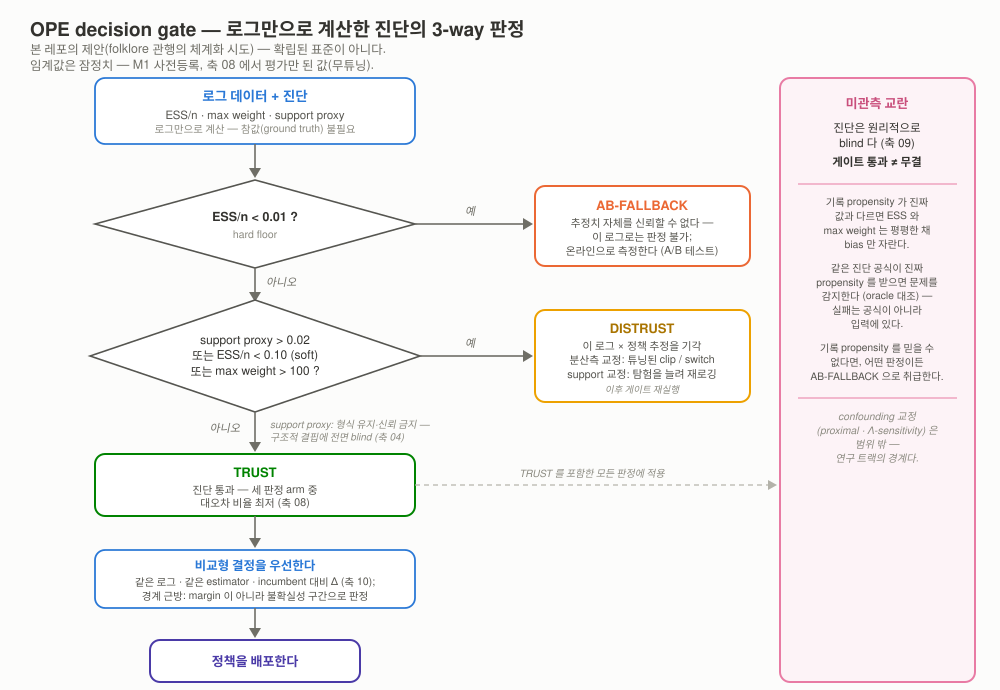
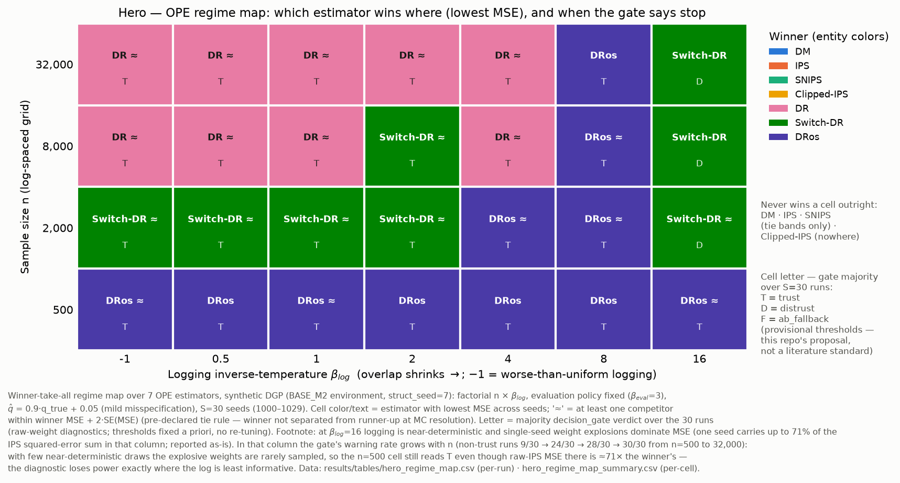
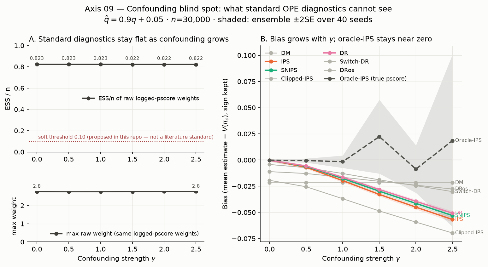
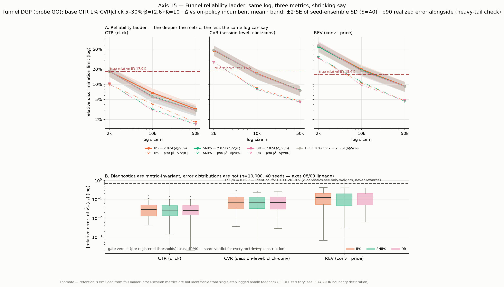

# ope-to-decision

**From logged bandit feedback to deployment decisions.**

> **A/B 테스트 전에, 이미 쌓인 추천 로그만으로 새 정책의 가치를 추정하고 — 그 추정을 언제 믿으면
> 안 되는지까지 판정하는 multi-action OPE 벤치마크 + 배포 게이트 플레이북.**

**🇰🇷 한국어 (정본)** · [🇺🇸 English](README.en.md)


-4a3aa7)


---

## ⏱️ TL;DR — 30초

- **문제.** 새 추천 정책을 트래픽에 태우기 전에 가치를 알고 싶다. A/B 슬롯은 한정이고 나쁜 정책은
  매출·UX 를 태우는데, 쌓인 로그는 *옛 정책이 고른 행동만* 기록했다 — Spotify 가 WSDM'19 에서 명시한
  바로 그 동기다 ([논문](https://research.atspotify.com/publications/offline-evaluation-to-make-decisions-about-playlistrecommendation-algorithms)).
- **접근.** OPE estimator 7종(DM·IPS·SNIPS·Clipped-IPS·DR·Switch-DR·DRos)을 numpy 로 직접 구현해
  obp/sb-obp 로 적대 교차검증하고, ground truth 를 아는 합성 DGP 에서 12개 축으로 체계적으로
  부러뜨린 뒤, 로그만으로 계산 가능한 진단(ESS·max-weight)이 그 부러짐을 언제 예보하는지를
  **"믿는다 / 못 믿는다 / A/B 회귀" 배포 게이트**로 체계화했다. 실데이터(UCI 4종·ZOZO 실로그)에서 재현.
- **핵심 결과 3줄.**
  1. **게이트는 예보한다** — 사전등록 임계값 기준, "trust" 판정에서 대오차(상대오차>10%) 비율
     **4.6%** vs "A/B 회귀" 판정에서 **44.4%** (LEDGER `m2-08-forecast`).
  2. **실데이터 재현** — DR 의 오지정 강건성 4/4 데이터셋 재현(DM bias −0.026~−0.387 vs |DR bias| ≤ 0.0032),
     ZOZO 실로그는 게이트가 **DISTRUST** 로 정확 판정 (LEDGER `m3-11-dr-robust`·`m3-12-gate-demo`).
  3. **한계까지 지도화** — 미관측 교란(unobserved confounding)에선 진단이 원리적으로 눈멀어, ESS 가
     0.823→0.822 로 정지한 채 IPS bias 만 0→−0.057 로 자란다 (LEDGER `m2-09-blindspot`).
- **임팩트.** "어떤 OPE 추정을 언제 믿을지"를 — 성공하는 곳과 실패하는 곳 모두 — ground truth 로
  실증한 재현 가능 의사결정 플레이북. 상세 규칙: [docs/PLAYBOOK.md](docs/PLAYBOOK.md).

## 핵심 결과 — hero 3장

<p align="center"><br>
<sub><b>그림 1 — decision gate.</b> 로그 진단(ESS·max-weight·support) → 기각 → 선택 → 믿는다/못
믿는다/A/B 회귀의 3-way 판정. 임계값은 M1 사전등록·축 08 에서 <b>평가만</b> 된 값(무튜닝) — 본 레포의
<b>제안</b>이지 표준이 아니다.</sub></p>

<p align="center"><br>
<sub><b>그림 2 — regime map (플로차트의 증거층).</b> n × β_log 28-cell 에서 최저-MSE estimator 승자
지도 + 게이트 다수결. DR-계열 3종이 교대 지배하고 DM·IPS 계열의 단독 승리는 0. 최대 발견은 경고다:
<b>진단 검정력은 소표본에서 실종된다</b> — 준결정 로깅(β=16)을 게이트가 n≥2000 에서만 잡아내고,
n=500 에선 trust 다수결인데 그 cell 의 IPS MSE 는 승자의 70.6× 다 (LEDGER <code>m3-hero-map</code>).</sub></p>

<p align="center"><br>
<sub><b>그림 3 — 진단이 못 보는 것.</b> confounding 강도 γ 가 커져도 기록-propensity 기반 ESS 는
평평(0.823→0.822)한데 bias 만 자란다(0→−0.057). 같은 ESS 공식이 <i>진짜</i> propensity 를 받으면
0.018 로 붕괴를 감지한다 — 공식이 아니라 입력이 눈멀게 한다 (LEDGER <code>m2-09-blindspot</code>).</sub></p>

## 읽는 방법 (레이어)

| 시간 | 읽을 것 |
|---|---|
| **30초** | 위 TL;DR + hero 3장 |
| **5분** | [2막 서사](#2막-서사) → [축별 발견](#핵심-발견--축별-한-줄) → [비즈니스 임팩트로의 번역](#비즈니스-임팩트로의-번역) → [부러지지 않은 것들](#부러지지-않은-것들--기대가-틀렸던-곳) |
| **재현** | [Quick Start](#quick-start) + [experiments/README.md](experiments/README.md) |
| **30분** | [docs/PLAYBOOK.md](docs/PLAYBOOK.md) → [docs/CONCEPT.md](docs/CONCEPT.md) → [docs/POSITIONING.md](docs/POSITIONING.md) → [docs/LEDGER.md](docs/LEDGER.md) |

## 2막 서사

**1막 — 로그로 정책을 평가한다.** 이커머스 추천 팀이 새 정책 후보를 만들었다. A/B 전에 어제까지의
로그만으로 새 정책의 기대 보상 $V(\pi_e)$ 를 추정한다 — Netflix·Airbnb·Amazon 도 같은 동기를 공개한
바 있다 ([Netflix](https://netflixtechblog.com/reinforcement-learning-for-budget-constrained-recommendations-6cbc5263a32a) ·
[Airbnb](https://arxiv.org/pdf/2508.00751) · [Amazon](https://www.amazon.science/publications/off-policy-evaluation-of-candidate-generators-in-two-stage-recommender-systems)).
estimator 는 여기서 *도구*로 등장한다: DM 의 model-bias 극단에서 IPS 의 variance 극단까지,
SNIPS → DR → Switch-DR/DRos 로 이어지는 bias-variance 아크 (그림 예:
[축 01](results/figures/01_sample_size.png) — 소표본 DM 우세 ↔ 대표본 IPS/DR 우세의 regime 교차).

**2막 — 그 추정을 믿어도 되나.** 진짜 질문은 점추정이 아니라 *신뢰 판정*이다. ESS·max-weight·support
진단이 위험을 예보하는 regime 과, 미관측 교란(unobserved confounding)처럼 진단이 **원리적으로 못
보는** regime 을 ground truth 로 갈라 보인 뒤
([Amazon Science RecSys'23](https://www.amazon.science/publications/offline-recommender-system-evaluation-under-unobserved-confounding)),
"믿는다 / 못 믿는다 / A/B 로 보낸다"의 배포 게이트로 체계화했다. 이 decision rule 은 **본 레포의
제안(문헌에 산발적으로 존재하는 folklore 의 체계화 시도)이지 확립된 표준이 아니다.**

## 무엇을 만들었고 어떻게 검증했나

| 구성 요소 | 내용 | 검증 |
|---|---|---|
| estimator 7종 | DM·IPS·SNIPS·Clipped-IPS·DR·Switch-DR·DRos — 순수 numpy (`src/ope/estimators.py`) | 3중: property test 63개 + **obp(py3.9)·sb-obp(py3.12) 두 트랙 교차검증 rel_diff ≤ 1e-8**(분기 발동 상태 — LEDGER `m1-crossval`) + 손계산 항등식 |
| 진단·게이트 | ESS·max-weight·support proxy + 3-way `decision_gate` (`src/ope/diagnostics.py`) — `dag-registry`(비공개 레포) OPE 스펙의 실행 실증 | 축 08 에서 사전등록 임계값 **평가**(무튜닝) — 예보력 실증 (LEDGER `m2-08-forecast`) |
| SLOPE | hyperparameter 데이터 기반 선택 (Su+ ICML'20) | **축 07 실험이 구현의 ladder 방향 반전 버그를 적발** → 수정·회귀 고정 — 수정 후 clipped tail p90 0.125→0.050 회복 (LEDGER `m2-07-slope`) |
| 합성 DGP | 참값 보유 multi-action bandit — overlap·support·오지정·confounding 노브 (`src/ope/dgp.py`) | on-policy 종단 검산·confounding 대조 항등 등 property test |
| 실데이터 2트랙 | classification-to-bandit(UCI 4종, 정확 참값) + OBD small(ZOZO 실로그, 근사 GT+CI) | §3.4 규약: 근사 GT 에 bootstrap CI 병기·점 비교 단정 금지 |
| 플레이북 | [docs/PLAYBOOK.md](docs/PLAYBOOK.md) — 게이트 규칙·비교형 우선 원칙·confounding 면책 | 수치는 전부 LEDGER 행 인용(자작 0) |

## 핵심 발견 — 축별 한 줄

수치가 있는 행은 LEDGER id 를 병기했다 — 그 외 축의 정량 상세는 각 figure 와 짝 CSV 가 정본이다.

| 축 | 발견 | 근거 |
|---|---|---|
| 01 | 소표본 DM 우세 ↔ 대표본 IPS/DR 우세의 regime 교차 실증 — "표본이 부족할 땐 모델을, 충분할 땐 데이터를 믿어라"가 그림 한 장으로 | [figure](results/figures/01_sample_size.png) |
| 02 | ESS 는 로깅 온도의 단조 함수가 아니다(평가 정책과 정렬되는 구간에서 정점 후 붕괴) — MSE cliff 는 β=8 이 아니라 8→16 사이 | [figure](results/figures/02_logging_beta.png) |
| 03 | 정책 괴리 스윕에서 DM 역전은 불발(유계 weight) — 진짜 붕괴는 naive clipping | [figure](results/figures/03_policy_gap.png) |
| 04 | 미지지 π_e 질량은 로그에서 식별 불능 — DR 도 잔존 bias, 전역 support proxy 는 **전면 blind**(0 신호 vs 참 결핍 0.143) | `m2-04-proxy-blind` |
| 05 | 곱셈 pscore 오염에 IPS 는 수백 배 악화, DR@정확-q̂ 은 평탄 생존 — "DR 을 구하는 건 한쪽 모델의 정확성" | [figure](results/figures/05_propensity_misspec.png) |
| 06 | DM bias 는 표본 불감 — n 을 2.5k→40k 로 늘려도 오지정 bias 는 그대로 | [figure](results/figures/06_reward_misspec.png) |
| 07 | 미튜닝 hyperparameter 불안정은 model-free 계열(clipped) 전용 — SLOPE(논문 방향 필수)가 tail 을 회복(p90 0.125→0.050) | `m2-07-slope` |
| 08 | 사전등록 게이트의 예보력: P(대오차\|trust)=4.6% vs P(대오차\|A/B 회귀)=44.4% — support arm 은 발화 0회(퇴화 정직 기록) | `m2-08-forecast` |
| 09 | confounding 에서 진단은 평평(ESS 0.823→0.822)·bias 만 성장(−0.057) — 진짜 propensity 를 주면 같은 공식이 감지(0.018) | `m2-09-blindspot` |
| 10 | 결정 안전성은 estimator 가 아니라 **비교 설계의 속성**: 같은-로그 비교는 오차 상쇄(fg 0.0), 혼합 비교는 bias 부활(DM fg 0.15/fs 0.375), 절대 임계는 전부 상속 | `m2-10-comparison` |
| 11 | 실데이터(UCI 4종)에서 DR 강건성 4/4 재현 + percentile bootstrap 은 구조적 bias 를 못 잡는다(9/28 CI 가 참값 미커버) | `m3-11-dr-robust` |
| 12 | ZOZO 실로그를 게이트가 DISTRUST 로 정확 판정(ESS/n 0.034·max w 278) — 판별력 없음(클릭 random 38건·bts 42건, GT CI ±32%)은 사전 선언 | `m3-12-gate-demo` |
| 13 | [스트레치] **probe NO-GO — drop(정직 기록)**: 유계 logit softmax DGP 에선 K=2000 에도 max_w≈2.8 로 IPS 무붕괴 — "액션 폭발 → MIPS 구원" 서사가 본 DGP family 에서 성립 불가(축 03 유계-weight 교훈과 일관), DGP 재설계 없이 착수 금지 | `m5-probe-13` |
| 14 | [스트레치] MSM Λ-sweep 실행 완료(probe GO 선행) — 순위 단정이 무너지는 breakdown Λ* 중앙값 ≈1.07(γ=0.5)·≈1.04(γ=1.5): 본 설정에선 confounding 이 셀수록 더 작은 감도 가정에서 순위 단정 불능. MSM bound 는 기존 published 방법(Kallus & Zhou 2018)의 **도구 시연**이며 Λ 는 데이터에서 식별되지 않는 가정 | `m5-14-lambda` |
| 15 | 같은 로그·같은 weight 에서 지표만 CTR→CVR→REV 로 깊어지면 판별 한계가 사다리처럼 가팔라진다(이벤트 희소 + price heavy tail) — 진단은 weight 만 보는 **지표 불변**이라 게이트 trust 가 깊은 지표의 판별력을 보증하지 않는다 | [figure](results/figures/15_funnel_reliability.png) |
| 16 | 다중 지표 guardrail 게이트(Δ̂CTR>0 ∧ Δ̂REV≥−g ∧ HHI≤h)는 비교형 원칙의 벡터 확장 — 단 중첩 지표가 같은 weight 를 공유해 결합 오류는 **군집 발생**(지표별 오류율 곱으로 낙관 금지); 광고주 노출 재분배·HHI 는 OPE 아닌 정확 계산 | [figure](results/figures/16_business_gate.png) |

## 비즈니스 임팩트로의 번역

<p align="center"><br>
<sub><b>축 15 — funnel 신뢰도 사다리.</b> 같은 로그·같은 weight, 지표만 CTR→CVR→REV 로 깊어질 때의
판별 한계. 정량 정본은 짝 CSV(<code>results/tables/15_funnel_reliability.csv</code>) — 본 섹션의
정량 수치는 LEDGER <code>m6-15-ladder</code>·<code>m6-16-gate</code> 행 경유(원값은 짝 CSV 재도출).</sub></p>

같은 로그·같은 importance weight 로 비즈니스 지표 벡터(CTR·CVR·REV — CVR 은 세션 기준,
[GLOSSARY](docs/GLOSSARY.md) §7)를 한 번에 평가할 수 있지만, 신뢰는 지표마다 같지 않다 — funnel 이
깊어질수록 이벤트가 희소해지고 price 의 heavy tail 이 얹혀 판별 한계가 사다리처럼 가팔라진다(축 15).
더 위험한 것은 진단이 weight 만 보므로 **지표에 불변**이라는 점이다: 게이트의 trust 판정은 weight
분산 위험의 예보일 뿐, 깊은 지표(REV)의 판별력 보증이 아니다. 다중 지표 guardrail 게이트(축 16)는
비교형 우선 원칙의 벡터 확장이지만, 중첩 지표가 같은 weight 를 공유해 결합 게이트의 오류는 지표별
오류율의 곱이 아니라 **군집으로** 발생한다. 게이트 규칙·경고의 정본은
[docs/PLAYBOOK.md](docs/PLAYBOOK.md) §8 "비즈니스 번역" 절이다. 리텐션 등 세션 간·장기 지표는
single-step bandit OPE 로 식별 불가라 **경계 밖으로 정직하게 선언**했다(RL OPE 소관 — 세션 내 proxy
도 자기기만 위험으로 미채택).

## 부러지지 않은 것들 — 기대가 틀렸던 곳

이 레포의 정직성 규약은 불발을 결과의 일부로 취급한다. 기대가 틀렸고 그대로 보고한 곳:

1. **축 02** — "β≥8 에서 폭발" 기대는 절반만: β=8 에선 IPS/DR 이 여전히 DM 보다 낫다. cliff 는 8→16 사이.
2. **축 03** — "큰 괴리에서 DM 역전" 불발: 로깅 logits 가 유계라 weight 폭발 자체가 없다. 대신
   λ=p90 naive clipping 이 DM 보다 나빠지는 것이 진짜 발견.
3. **축 04** — support proxy 는 "부분 신호" 기대보다 나쁜 **전면 blind** — 게이트의 support arm 은
   형식만 유지하고 신뢰하지 않는다고 플레이북에 명시.
4. **축 10** — 최초 설계는 전 estimator 만점(null). 원인 규명(공통 오차 상쇄 + rank-보존 오지정) 후
   "비교 설계의 속성"이라는 더 나은 질문으로 재설계 — 설계 이력은 스크립트 docstring 에 남김.
5. **축 12** — OBD small 은 estimator 판별력이 없다(사전 선언). 이 축의 가치는 판별이 아니라
   "실로그 규약 준수 + 게이트가 이런 로그를 실제로 기각하는가"의 시연.
6. **SLOPE 구현 버그** — 축 07 실험이 ladder 방향 반전(논문과 역)을 적발했다. 실험이 코드를 검증한
   사례로, 수정·회귀 테스트와 함께 기록.

**추가 스코핑.** 합성 결론은 단일 환경 구조(struct_seed=7) 조건부다 — regime 경계의 위치는 환경에
따라 움직일 수 있다(방향성 주장만). c2b 는 결정적 reward 라 DR 잔차에 노이즈 채널이 없다. decision
rule 임계값은 사전등록·무튜닝 — 다른 도메인 이식은 재교정 없이는 무근거다. **미관측 교란의 식별·교정
본류(proximal 등)는 범위 밖** — 본 레포는 blind spot 의 전시(축 09)에서 의도적으로 멈춘다.

## 비범위 (경계 선언)

- **OPL · CATE · 정책 학습** — 범위 밖. binary-treatment 정책·CATE 는
  [kr_segmentation_causal_targeting_dunnhumby](https://github.com/tae73/kr_segmentation_causal_targeting_dunnhumby),
  CATE 방법 카탈로그는 `causal-inference`(비공개 레포) 소관 (상호 링크).
- **slate/ranking OPE (PI·IIPS·RIPS) · RL OPE (FQE·DICE)** — 범위 밖. 본 레포의 정체성은
  *multi-action single-step logged bandit* OPE 다.
- **confounding 하 식별의 본류(proximal 등)** — 연구 트랙 소관. 본 레포는 축 09 의 "진단이 못 보는
  것" 대조(+ probe GO 로 실행한 축 14 Λ-sweep — 기존 published bound 의 도구 시연)에서
  **의도적으로 멈춘다**.
- 진단 스펙 문서 ↔ 실행 구현: `dag-registry`(비공개 레포) 와 보완 관계. 축별 실험 패턴은
  [mta-simulation](https://github.com/tae73/mta-simulation) 하우스 스타일 계승.

## Quick Start

```bash
cd ope-to-decision
uv sync --extra dev        # 본 env (Python 3.11+)
uv run pytest              # property test 63개 (항등식·통계 성질·회귀 고정)

# 축 실험 재현 (예: 축 01 — figure + CSV 페어 재생성)
uv run python experiments/01_sample_size.py

# obp/sb-obp 교차검증 (pinned env 셋업·함정 포함 레시피)
#   → experiments/README.md 의 "m1_crossval" 절 참조 (matplotlib<3.7 핀 필수 등)
```

실데이터: OpenML 4종은 최초 실행 시 자동 다운로드(`data/openml` 캐시), OBD small 은
[data/README.md](data/README.md) 안내대로 로컬 배치(재배포 금지).

## Repository Structure

```
ope-to-decision/
├── src/ope/               # estimators(7종+SLOPE+bootstrap) · dgp · diagnostics(게이트) · policies · datasets · business(funnel 지표 벡터)
├── experiments/           # 축 01–12·14–16 + probes/ + m1_crossval/ + hero_regime_map (인덱스: experiments/README.md)
├── results/figures|tables # 실험 산출물 — NN_* figure↔CSV 1:1 규약 (수치 정본은 docs/LEDGER.md 경유)
├── docs/                  # PLAYBOOK · CONCEPT · POSITIONING · LEDGER · GLOSSARY · COMMS_BRIEF
├── assets/                # decision-gate 플로차트 SVG (ko/en)
├── configs/  tests/       # Hydra 설계 기본값 / property test 63
├── data/                  # gitignore — 원본 재배포 금지 (data/README.md)
└── PLAN.md  CLAUDE.md     # 마일스톤·게이트 / 에이전트 규약
```

## 문서 지도 (30분 층)

| 문서 | 내용 |
|---|---|
| [docs/PLAYBOOK.md](docs/PLAYBOOK.md) | **배포 게이트 플레이북** — 3-way 규칙·비교형 게이트 우선 원칙·confounding 면책 조항 (수치는 LEDGER 행만 인용) |
| [docs/CONCEPT.md](docs/CONCEPT.md) | 컨셉 1-pager — 동기·메커니즘·검증가능 주장 |
| [docs/POSITIONING.md](docs/POSITIONING.md) | 선점확인·차별화 갭·인접 레포 경계 (전 주장 출처 URL) |
| [docs/LEDGER.md](docs/LEDGER.md) | **정본 수치 단일 진실표** — 이 README 의 모든 수치가 경유하는 곳 |
| [docs/GLOSSARY.md](docs/GLOSSARY.md) | KO/EN 용어 단일기준 |
| [PLAN.md](PLAN.md) | 마일스톤·게이트·축 매핑·폴백 체인 (M0–M4 완료 이력 포함) |

## Attribution & References

- **데이터:** [Open Bandit Dataset](https://research.zozo.com/data.html) (ZOZO Research — 별도 이용
  조건, 본 레포는 변환 스크립트만 커밋) · UCI/OpenML (optdigits·satimage·pendigits·letter).
- **교차검증 기준:** [obp / Open Bandit Pipeline](https://github.com/st-tech/zr-obp) ·
  [sb-obp](https://github.com/sb-ai-lab/sb-obp) — API 는 참조, 구현은 전부 자체 numpy.
- **핵심 문헌:** DM/IPS/DR [Dudík-Langford-Li 2011](https://arxiv.org/abs/1103.4601) · SNIPS
  [Swaminathan-Joachims 2015](https://papers.nips.cc/paper/2015/hash/39027dfad5138c9ca0c474d71db915c3-Abstract.html) ·
  Switch-DR [Wang+ 2017](https://arxiv.org/abs/1612.01205) · DRos [Su+ 2020](https://arxiv.org/abs/1907.09623) ·
  SLOPE [Su+ ICML'20](http://proceedings.mlr.press/v119/su20d/su20d.pdf) · IEOE
  [Saito+ RecSys'21](https://arxiv.org/abs/2108.13703) · deficient support
  [Sachdeva+ KDD'20](https://arxiv.org/abs/2006.09438) · Δ-OPE [Jeunen+ RecSys'24](https://arxiv.org/abs/2405.10024) ·
  confounded eval [Amazon RecSys'23](https://www.amazon.science/publications/offline-recommender-system-evaluation-under-unobserved-confounding) ·
  OBD [Saito+ 2020](https://arxiv.org/abs/2008.07146). 전체 계보: [docs/POSITIONING.md](docs/POSITIONING.md) §6.

## 정직성 각주

1. **수치는 LEDGER 경유만.** 이 README 의 모든 결과 수치는 committed 산출물(`results/tables/`)에서
   만든 [docs/LEDGER.md](docs/LEDGER.md) 행을 인용한다(행 id 병기). 본문·배지의 축약 표기(4.6%·44.4%·
   −0.057 등)는 해당 행 원값 기준 반올림이다 — 원값·정밀도는 LEDGER 가 정본. 테스트 개수 등 공정
   메타데이터(배지 tests 63)는 실험 결과 수치가 아니므로 LEDGER 범위 밖이다.
2. **decision rule = 제안.** 게이트 규칙·임계값은 M1 에서 folklore 로 사전 등록되어 축 08 에서
   **평가만** 되었다(무튜닝·교정 아님) — 표준이 아니며, 실패 조건(축 09 blind spot·support arm 퇴화)을
   함께 전시한다.
3. **근사 참값 규약.** OBD small 의 ground truth 는 근사값이라 관련 figure 전부에 bootstrap CI 를
   병기하고 점 비교를 단정하지 않는다(합성 축의 정확 참값과 의미 구분 — LEDGER `m3-12-gate-demo`).
4. **데이터 보호.** `data/` 는 라이선스상 재배포 금지로 gitignore — [data/README.md](data/README.md).

*License: MIT (코드) — 데이터는 각 출처의 조건을 따른다. KO 정본 · [EN twin](README.en.md) 은 자연
재작성(GLOSSARY 정합, 수치 동일 LEDGER 행).*
