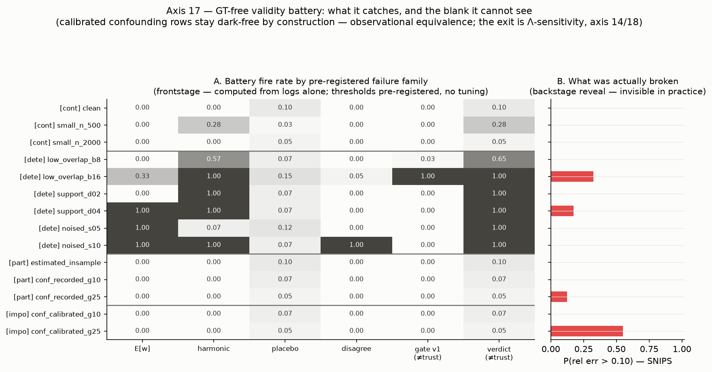
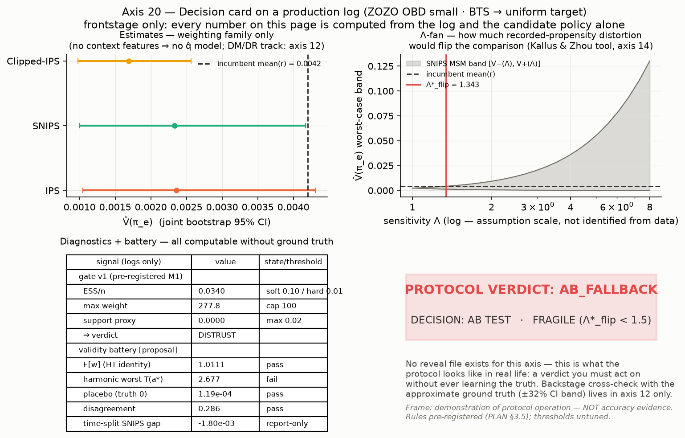

# ope-to-decision

**From logged bandit feedback to deployment decisions — without ever seeing the truth.**

> **당신은 로그와 후보 정책만 가졌다 — 실무에서 참값 $V(\pi_e)$ 는 아무도 모른다.
> 로그만으로 계산 가능한 신호로 "믿는다 / 못 믿는다 / A/B 로 보낸다"를 판정하고, 그 신호의
> 예보력과 맹점은 참값을 아는 백스테이지에서 채점한 multi-action OPE 프로토콜 + 벤치마크.**

**🇰🇷 한국어 (정본)** · [🇺🇸 English](README.en.md)


-4a3aa7)


---

## ⏱️ TL;DR — 30초

- **문제.** 새 추천 정책을 트래픽에 태우기 전에 가치를 알고 싶다. A/B 슬롯은 한정이고 나쁜 정책은
  매출·UX 를 태우는데, 쌓인 로그는 *옛 정책이 고른 행동만* 기록했다 — Spotify 가 WSDM'19 에서 명시한
  바로 그 동기다 ([논문](https://research.atspotify.com/publications/offline-evaluation-to-make-decisions-about-playlistrecommendation-algorithms)).
  그리고 진짜 문제가 하나 더 있다: **실무에선 참값 $V(\pi_e)$ 를 아무도 모른다.** 추정이 맞았는지
  채점해 줄 사람이 없는 곳에서, 무엇을 계산할 수 있고 언제 멈춰야 하는가.
- **접근.** 로그만으로 계산 가능한 신호를 사전등록 프로토콜로 조립했다 — 진단 3종(ESS·max-weight·
  support) → 3-way 게이트, **validity battery**(E[w]·harmonic calibration·placebo·disagreement —
  필요조건 검사), 감도 증명서 Λ\*. 이 신호들이 실제로 오류를 예보하는지, 그리고 **어디서 원리적으로
  눈머는지**는 참값을 아는 백스테이지(합성 DGP·UCI c2b·OBD 근사 GT)에서 blind-then-reveal 로
  채점했다. estimator 7종은 numpy 직접 구현 + obp/sb-obp 적대 교차검증.
- **핵심 결과 3줄.**
  1. **실로그에서 프로토콜은 스스로 멈춘다** — ZOZO 실로그를 로그만 보고 판정: 게이트 distrust +
     battery harmonic 발화(기록 propensity↔경험 빈도 비정합) → **AB_FALLBACK**, Λ\*_flip 1.34 로
     fragile. 참값 채점표는 존재하지 않는다 — 이것이 실전이다 (LEDGER `m8-20-card`).
  2. **프로토콜의 결정 가치를 정량화했다** — 오염 로그(propensity noise)에서 naive IPS 점추정은
     진짜 나쁜 후보에 **false-go 0.9**(평균 regret 0.21)를 내지만, 프로토콜은 **0.0**(battery 발화
     → A/B 회귀). 건강한 로그에선 결정적이다: 좋은 후보 go 0.95·나쁜 후보 no-go 0.9, 오류 0
     (LEDGER `m8-19-decision-value`).
  3. **못 보는 것의 경계까지 지도화했다** — battery 는 misrecording·support 결핍을 잡지만(축 17
     detection matrix), 기록이 marginally calibrated 인 confounding 은 **어떤 로그 통계로도 구별
     불가**: 검출 arm 발화가 기록 모드별 0/240 인 채 bias 만 −0.073 까지 자란다(축 18, LEDGER `m8-18-boundary`) — 출구는
     점추정이 아니라 Λ-감도 구간이다.
- **임팩트.** "로그만 가진 사람"이 실제로 밟을 수 있는 판정 절차와, 그 절차를 믿어도 되는 범위·
  안 되는 범위의 지도. 규칙 정본: [docs/PLAYBOOK.md](docs/PLAYBOOK.md).

## 동기 — 참값이 있는 무대에서 이미 본 것

<p align="center"><br>
<sub><b>동기 그림 (축 09 — 백스테이지).</b> confounding 강도 γ 가 커져도 기록-propensity 기반 ESS 는
평평(0.823→0.822)한데 bias 만 자란다(0→−0.057) — 같은 공식이 <i>진짜</i> propensity 를 받으면 0.018
로 붕괴를 감지한다 (LEDGER <code>m2-09-blindspot</code>). <b>그런데 실무에선 이 그림의 아래 패널
(bias)을 볼 수 없다.</b> 당신이 보는 것은 평평한 위 패널뿐이다. 이 레포의 본편은 그래서 두 부분으로
설계됐다 — 로그만으로 <i>잡을 수 있는</i> 실패를 잡는 battery, 그리고 <i>잡을 수 없는</i> 실패에
대한 감도 증명서 Λ\*.</sub></p>

## 핵심 결과 — hero 3장

<p align="center"><br>
<sub><b>그림 1 — decision gate (본편의 척추).</b> 로그 진단(ESS·max-weight·support) → 기각 → 선택 →
믿는다/못 믿는다/A/B 회귀의 3-way 판정 — <b>이 페이지의 본편은 전부 참값 불필요다.</b> 임계값은 M1
사전등록·축 08 에서 <b>평가만</b> 된 값(무튜닝), M8 의 validity battery(gate v2 [제안])가 같은
규율로 병렬 합류한다. 본 레포의 <b>제안</b>이지 표준이 아니다.</sub></p>

<p align="center"><br>
<sub><b>그림 2 — battery 가 잡는 것과 못 보는 빈칸 (축 17).</b> 사전등록 실패 family × battery arm
의 발화율 히트맵(frontstage — 로그만) 과 실제 대오차율(backstage reveal). misrecording(E[w] 발화
1.0)·구조적 support 결핍(δ=0.2 는 전역 신호가 전멸해도 per-action harmonic 이 1.0 으로 회수)은
잡히고, <b>calibrated confounding 행은 검출 arm 발화 0 인 채 대오차율 0.55</b> — 빈칸을 그대로 전시한다
(LEDGER <code>m8-17-matrix</code>).</sub></p>

<p align="center"><br>
<sub><b>그림 3 — 실전 한 판: reveal 없는 판정 카드 (축 20).</b> ZOZO OBD 실로그(BTS → uniform 타깃)에
프로토콜 전체를 돌린 1-page 카드 — 추정+CI·진단·battery·Λ-부채꼴·판정, 전부 로그와 후보 분포만으로.
판정은 AB_FALLBACK(harmonic 발화 — 기록 propensity 비정합 신호)·fragile(Λ\*_flip 1.34). <b>이 축엔
채점표(reveal 파일)가 없다</b> — 근사 GT 와의 백스테이지 대조는 축 12 소관(LEDGER
<code>m8-20-card</code>·<code>m3-12-gate-demo</code>).</sub></p>

## 읽는 방법 (레이어)

| 시간 | 읽을 것 |
|---|---|
| **30초** | 위 TL;DR + 동기 그림 + hero 3장 |
| **5분** | [3막 서사](#3막-서사) → [축별 발견](#핵심-발견--축별-한-줄-2-tier) → [비즈니스 임팩트로의 번역](#비즈니스-임팩트로의-번역) → [부러지지 않은 것들](#부러지지-않은-것들--기대가-틀렸던-곳) |
| **상세 분석** | [notebooks/](notebooks/README.md) — 로그 EDA → DGP 해부 → estimator walkthrough → 진단·게이트 → 결과 심층 (5권, 실행 output 포함 — M8 반영 전 파생층) |
| **재현** | [Quick Start](#quick-start) + [experiments/README.md](experiments/README.md) |
| **30분** | [docs/PLAYBOOK.md](docs/PLAYBOOK.md) → [docs/CONCEPT.md](docs/CONCEPT.md) → [docs/POSITIONING.md](docs/POSITIONING.md) → [docs/LEDGER.md](docs/LEDGER.md) |

## 3막 서사

**1막 — 당신이 가진 것: 로그와 후보 정책뿐이다.** 이커머스 추천 팀이 새 정책 후보를 만들었다. A/B
전에 어제까지의 로그만으로 새 정책의 기대 보상 $V(\pi_e)$ 를 추정한다 — Netflix·Airbnb·Amazon 도
같은 동기를 공개한 바 있다
([Netflix](https://netflixtechblog.com/reinforcement-learning-for-budget-constrained-recommendations-6cbc5263a32a) ·
[Airbnb](https://arxiv.org/pdf/2508.00751) ·
[Amazon](https://www.amazon.science/publications/off-policy-evaluation-of-candidate-generators-in-two-stage-recommender-systems)).
로그가 주는 것: estimator 7종(DM 의 model-bias 극단에서 IPS 의 variance 극단까지 — SNIPS → DR →
Switch-DR/DRos 의 bias-variance 아크), 진단 3종, 같은-로그 Δ 비교, validity battery, Λ-밴드 —
**전부 참값 불요**. 로그가 못 주는 것: bias·MSE·"내 추정이 맞았는지". 후보 정책도 로그에서 만들 수
있다(축 19 — crossfit q̂ 위 softmax, fit/eval 분리).

**2막 — 언제 멈춰야 하는가: 로그만으로 계산하는 신호들.** 진짜 질문은 점추정이 아니라 *신뢰
판정*이다. ① **게이트**(진단 3종 → trust/distrust/ab_fallback — 본 레포의 제안, folklore 체계화
시도이지 표준 아님) ② **validity battery** [제안 — gate v2]: E[w]=1 (HT 항등)·per-action harmonic
calibration·placebo(참값 0 음성 대조)·estimator disagreement — 전부 **필요조건 검사**로, 통과는
무결의 증명이 아니다 ③ **Λ\*_flip**: "이 결론이 뒤집히려면 기록 propensity 가 얼마나 왜곡돼 있어야
하는가"의 감도 보고서(Kallus & Zhou bound 의 도구 사용 — Λ 는 식별 불가 가정). 실전 시연이 그림 3
이다 — ZOZO 실로그에서 이 신호들만으로 AB_FALLBACK 이 나온다. **신호의 원리적 한계도 같은 자리에
전시한다**: 기록 propensity 기반 신호 전부(ESS·E[w]·harmonic)는 calibrated confounding 에 공동으로
blind 다(동기 그림·축 18) — 그리고 백스테이지 경고 하나를 미리 가져온다: **진단·battery 의 검정력은
소표본에서 흔들린다**(게이트는 n=500 에서 준결정 로깅을 놓치고[`m3-hero-map`], harmonic 은 같은
n 에서 오경보 0.275 를 낸다[`m8-17-matrix`]).

**3막 — 백스테이지: 참값을 아는 무대에서 신호를 채점하다.** 이 신호들을 왜 믿는가에 대한 답. 참값
보유 합성 DGP 12축 + c2b 4종 + OBD 근사 GT 에서 전부 채점했다: 게이트 예보력 — trust 대오차율
4.6% vs A/B 회귀 44.4%(`m2-08-forecast`); battery 예보력 — detectable family 전 시나리오에서 발화 신호 성립(약한 노브는 부분 발화)·
partial/impossible 검출 arm 발화 0(그림 2); **결정 가치** — naive false-go 0.9 vs 프로토콜 0.0
(`m8-19-decision-value`); DR 강건성 실데이터 4/4(`m3-11-dr-robust`). 그리고 blind spot 의 정직
공시: 관측 동등성 세계에서 battery 전항이 통과한 채 bias 만 자라고(축 18 — 동기 그림의 GT-미상
세대교체), Λ\*_flip 중앙값은 1.31→1.05 로 수축해 **결론이 "이유를 모른 채" 취약해지는 것만**
보고된다(`m8-18-boundary`).

<p align="center"><br>
<sub><b>백스테이지 증거층 — regime map.</b> n × β_log 28-cell 최저-MSE estimator 승자 지도 + 게이트
다수결. DR-계열 3종이 교대 지배하고 DM·IPS 계열의 단독 승리는 0. 최대 발견은 경고다: <b>진단
검정력은 소표본에서 실종된다</b> — 준결정 로깅(β=16)을 게이트가 n≥2000 에서만 잡아내고, n=500 에선
trust 다수결인데 그 cell 의 IPS MSE 는 승자의 70.6× 다 (LEDGER <code>m3-hero-map</code>).</sub></p>

## 무엇을 만들었고 어떻게 검증했나

| 구성 요소 | 내용 | 검증 |
|---|---|---|
| **practitioner 프로토콜 (본편)** | frontstage 스키마(`experiments/_practitioner.py` — 산출 CSV 에 참값 컬럼 부재)·결정 규칙 사전등록(PLAN §3.5) | 계약 테스트 4중(스키마 ban·소스 ban·blindness·reveal 파일 경유) + 축 17–20 blind-then-reveal |
| **validity battery [제안]** | E[w]·harmonic·placebo·disagreement + 보고 4종 (`src/ope/validity.py`) — gate v1 과 독립·병렬 | probe M8-A/M8-B GO 선행 · 축 17 family×arm 채점(`m8-17-matrix`) · 축 18 경계 전시(`m8-18-boundary`) |
| estimator 7종 | DM·IPS·SNIPS·Clipped-IPS·DR·Switch-DR·DRos — 순수 numpy (`src/ope/estimators.py`) | 3중: property test 97개 + **obp(py3.9)·sb-obp(py3.12) 두 트랙 교차검증 rel_diff ≤ 1e-8**(분기 발동 상태 — LEDGER `m1-crossval`) + 손계산 항등식 |
| 진단·게이트 (gate v1) | ESS·max-weight·support proxy + 3-way `decision_gate` (`src/ope/diagnostics.py`) | 축 08 에서 사전등록 임계값 **평가**(무튜닝) — 예보력 실증 (LEDGER `m2-08-forecast`) |
| SLOPE | hyperparameter 데이터 기반 선택 (Su+ ICML'20) | **축 07 실험이 구현의 ladder 방향 반전 버그를 적발** → 수정·회귀 고정 — 수정 후 clipped tail p90 0.125→0.050 회복 (LEDGER `m2-07-slope`) |
| 합성 DGP (백스테이지) | 참값 보유 multi-action bandit — overlap·support·오지정·confounding 노브 + U-주변화 calibrated 기록(`src/ope/dgp.py`) | on-policy 종단 검산·confounding 대조 항등·**산출 checksum 동결 배리어** property test |
| 실데이터 2트랙 | classification-to-bandit(UCI 4종, 정확 참값) + OBD small(ZOZO 실로그, 근사 GT+CI) | §3.4 규약: 근사 GT 에 bootstrap CI 병기·점 비교 단정 금지 |
| 플레이북 | [docs/PLAYBOOK.md](docs/PLAYBOOK.md) — 게이트+battery 규칙·비교형 우선·confounding 면책 | 수치는 전부 LEDGER 행 인용(자작 0) |

## 핵심 발견 — 축별 한 줄 (2-tier)

축 번호는 실행 이력 순서다 — 서사 순서가 아니며 재부여하지 않는다(PLAN §6). 수치가 있는 행은
LEDGER id 를 병기했다 — 그 외 축의 정량 상세는 각 figure 와 짝 CSV 가 정본이다.

**Tier 1 — 본편 (GT-미상 레짐: 로그만으로 계산·판정)**

| 축 | 발견 | 근거 |
|---|---|---|
| 12 | ZOZO 실로그를 게이트가 DISTRUST 로 판정(ESS/n 0.034·max w 278) — 백스테이지 근사 GT(±32% CI)가 판정을 뒷받침, 판별력 없음(클릭 random 38건·bts 42건)은 사전 선언 | `m3-12-gate-demo` |
| 14 | [스트레치] 순위 단정이 무너지는 breakdown Λ\* 중앙값 ≈1.07(γ=0.5)·≈1.04(γ=1.5) — **계산 자체는 로그만 필요**, Λ 는 식별 불가 가정·수치는 합성 시연(Kallus & Zhou 도구) | `m5-14-lambda` |
| 17 | battery detection matrix — misrecording·support 는 잡히고(δ=0.2 의 전역-신호 전멸을 per-action harmonic 이 회수), partial/impossible 은 검출 arm 발화 0 인 채 대오차율 0.55: **빈칸 전시**. 소표본 harmonic 오경보 0.275 정직 기록 | `m8-17-matrix` |
| 18 | 관측 동등성 경계 — 검출 arm 발화 0/240·0/240(기록 모드별)·bias 만 −0.073 성장·Λ\*_flip 1.31→1.05 수축: battery 는 blind spot 을 **줄이지만 없애지 못한다** | `m8-18-boundary` |
| 19 | end-to-end blind decision — 오염 로그에서 naive false-go 0.9(regret 0.21) vs 프로토콜 0.0(AB 회귀), 건강 로그에선 go 0.95/no-go 0.9 로 결정적(오류 0); 후보도 로그 유래(fit/eval 분리) | `m8-19-decision-value` |
| 20 | 실로그 1-page decision card(reveal 없음) — harmonic 실발화(T=2.68: 기록 propensity 비정합 신호, 위치 풀링 인공물 가능성 병기) → AB_FALLBACK·fragile | `m8-20-card` |

**Tier 2 — 백스테이지 (참값 보유 채점 — 본편 신호의 근거와 한계)**

| 축 | 발견 | 근거 |
|---|---|---|
| 01 | 소표본 DM 우세 ↔ 대표본 IPS/DR 우세의 regime 교차 실증 — "표본이 부족할 땐 모델을, 충분할 땐 데이터를 믿어라"가 그림 한 장으로 | [figure](results/figures/01_sample_size.png) |
| 02 | ESS 는 로깅 온도의 단조 함수가 아니다(평가 정책과 정렬되는 구간에서 정점 후 붕괴) — MSE cliff 는 β=8 이 아니라 8→16 사이 | [figure](results/figures/02_logging_beta.png) |
| 03 | 정책 괴리 스윕에서 DM 역전은 불발(유계 weight) — 진짜 붕괴는 naive clipping | [figure](results/figures/03_policy_gap.png) |
| 04 | 미지지 π_e 질량은 로그에서 식별 불능 — DR 도 잔존 bias, 전역 support proxy 는 **전면 blind**(0 신호 vs 참 결핍 0.143) — M8 에서 E[w]·harmonic 이 이 사각을 부분 회수(축 17) | `m2-04-proxy-blind` |
| 05 | 곱셈 pscore 오염에 IPS 는 수백 배 악화, DR@정확-q̂ 은 평탄 생존 — "DR 을 구하는 건 한쪽 모델의 정확성" | [figure](results/figures/05_propensity_misspec.png) |
| 06 | DM bias 는 표본 불감 — n 을 2.5k→40k 로 늘려도 오지정 bias 는 그대로 | [figure](results/figures/06_reward_misspec.png) |
| 07 | 미튜닝 hyperparameter 불안정은 model-free 계열(clipped) 전용 — SLOPE(논문 방향 필수)가 tail 을 회복(p90 0.125→0.050) | `m2-07-slope` |
| 08 | 사전등록 게이트의 예보력: P(대오차\|trust)=4.6% vs P(대오차\|A/B 회귀)=44.4% — support arm 은 발화 0회(퇴화 정직 기록); 축 17–19 의 blind-then-reveal 이 이 축의 프로토콜-층 일반화다 | `m2-08-forecast` |
| 09 | confounding 에서 진단은 평평(ESS 0.823→0.822)·bias 만 성장(−0.057) — 진짜 propensity 를 주면 같은 공식이 감지(0.018) — **본편의 동기 그림**, GT-미상 세대교체는 축 18 | `m2-09-blindspot` |
| 10 | 결정 안전성은 estimator 가 아니라 **비교 설계의 속성**: 같은-로그 비교는 오차 상쇄(fg 0.0), 혼합 비교는 bias 부활(DM fg 0.15/fs 0.375), 절대 임계는 전부 상속 — GT-미상 판은 축 19 | `m2-10-comparison` |
| 11 | 실데이터(UCI 4종)에서 DR 강건성 4/4 재현 + percentile bootstrap 은 구조적 bias 를 못 잡는다(9/28 CI 가 참값 미커버) | `m3-11-dr-robust` |
| 13 | [스트레치] **probe NO-GO — drop(정직 기록)**: 유계 logit softmax DGP 에선 K=2000 에도 max_w≈2.8 로 IPS 무붕괴 — "액션 폭발 → MIPS 구원" 서사가 본 DGP family 에서 성립 불가, DGP 재설계 없이 착수 금지 | `m5-probe-13` |
| 15 | 같은 로그·같은 weight 에서 지표만 CTR→CVR→REV 로 깊어지면 판별 한계가 사다리처럼 가팔라진다(이벤트 희소 + price heavy tail) — 진단은 weight 만 보는 **지표 불변**이라 게이트 trust 가 깊은 지표의 판별력을 보증하지 않는다 | [figure](results/figures/15_funnel_reliability.png) |
| 16 | 다중 지표 guardrail 게이트(Δ̂CTR>0 ∧ Δ̂REV≥−g ∧ HHI≤h)는 비교형 원칙의 벡터 확장 — 단 중첩 지표가 같은 weight 를 공유해 결합 오류는 **군집 발생**(지표별 오류율 곱으로 낙관 금지); 광고주 노출 재분배·HHI 는 OPE 아닌 정확 계산 | [figure](results/figures/16_business_gate.png) |

## 비즈니스 임팩트로의 번역

> 이 절의 실험(축 15·16)은 **백스테이지 무대**(참값 보유 funnel DGP)의 채점이다 — 지표별 판별
> 한계·오차 군집이라는 경고 자체가 본편 프로토콜을 지표 벡터로 확장할 때의 사용 설명서다.

<p align="center"><br>
<sub><b>축 15 — funnel 신뢰도 사다리.</b> 같은 로그·같은 weight, 지표만 CTR→CVR→REV 로 깊어질 때의
판별 한계. 정량 정본은 짝 CSV(<code>results/tables/15_funnel_reliability.csv</code>) — 본 섹션의
정량 수치는 LEDGER <code>m6-15-ladder</code>·<code>m6-16-gate</code> 행 경유(원값은 짝 CSV 재도출).</sub></p>

같은 로그·같은 importance weight 로 비즈니스 지표 벡터(CTR·CVR·REV — CVR 은 세션 기준,
[GLOSSARY](docs/GLOSSARY.md) §7)를 한 번에 평가할 수 있지만, 신뢰는 지표마다 같지 않다 — funnel 이
깊어질수록 이벤트가 희소해지고 price 의 heavy tail 이 얹혀 판별 한계가 사다리처럼 가팔라진다(축 15).
더 위험한 것은 진단이 weight 만 보므로 **지표에 불변**이라는 점이다: 게이트의 trust 판정은 weight
분산 위험의 예보일 뿐, 깊은 지표(REV)의 판별력 보증이 아니다. 다중 지표 guardrail 게이트(축 16)는
비교형 우선 원칙의 벡터 확장이지만, 중첩 지표가 같은 weight 를 공유해 결합 게이트의 오류는 지표별
오류율의 곱이 아니라 **군집으로** 발생한다. 게이트 규칙·경고의 정본은
[docs/PLAYBOOK.md](docs/PLAYBOOK.md) §8 "비즈니스 번역" 절이다. 리텐션 등 세션 간·장기 지표는
single-step bandit OPE 로 식별 불가라 **경계 밖으로 정직하게 선언**했다(RL OPE 소관 — 세션 내 proxy
도 자기기만 위험으로 미채택).

## 부러지지 않은 것들 — 기대가 틀렸던 곳

이 레포의 정직성 규약은 불발을 결과의 일부로 취급한다. 기대가 틀렸고 그대로 보고한 곳:

1. **축 02** — "β≥8 에서 폭발" 기대는 절반만: β=8 에선 IPS/DR 이 여전히 DM 보다 낫다. cliff 는 8→16 사이.
2. **축 03** — "큰 괴리에서 DM 역전" 불발: 로깅 logits 가 유계라 weight 폭발 자체가 없다. 대신
   λ=p90 naive clipping 이 DM 보다 나빠지는 것이 진짜 발견.
3. **축 04** — support proxy 는 "부분 신호" 기대보다 나쁜 **전면 blind** — 게이트의 support arm 은
   형식만 유지하고 신뢰하지 않는다고 플레이북에 명시.
4. **축 10** — 최초 설계는 전 estimator 만점(null). 원인 규명(공통 오차 상쇄 + rank-보존 오지정) 후
   "비교 설계의 속성"이라는 더 나은 질문으로 재설계 — 설계 이력은 스크립트 docstring 에 남김.
5. **축 12** — OBD small 은 estimator 판별력이 없다(사전 선언). 이 축의 가치는 판별이 아니라
   "실로그 규약 준수 + 게이트가 이런 로그를 실제로 기각하는가"의 시연.
6. **SLOPE 구현 버그** — 축 07 실험이 ladder 방향 반전(논문과 역)을 적발했다. 실험이 코드를 검증한
   사례로, 수정·회귀 테스트와 함께 기록.
7. **M8 — "부분 검출" 예상 반증** — 의도값 기록(as-recorded) confounding 의 miscalibration 을
   battery 가 부분 검출하리라는 예상은 probe·축 17·18 에서 반증됐다(발화 0) — 경계 전시는 "양쪽 다
   비발화·bias 만 성장"으로 오히려 강화 (`m8-probe-b`·`m8-18-boundary`).
8. **M8 — harmonic 의 소표본 오경보** — n=500 control 에서 harmonic arm 오경보 0.275: battery 도
   소표본 함정에서 자유롭지 않다(hero map 의 게이트 검정력 실종과 짝을 이루는 battery 판 —
   `m8-17-matrix`).

**추가 스코핑.** 합성 결론은 단일 환경 구조(struct_seed=7) 조건부다 — regime 경계의 위치는 환경에
따라 움직일 수 있다(방향성 주장만). c2b 는 결정적 reward 라 DR 잔차에 노이즈 채널이 없다. decision
rule·battery 임계값은 사전등록·무튜닝 — 다른 도메인 이식은 재교정 없이는 무근거다. **미관측 교란의
식별·교정 본류(proximal 등)는 범위 밖** — 본 레포는 blind spot 의 전시(축 09 → 축 18 경계)에서
의도적으로 멈춘다.

## 비범위 (경계 선언)

- **OPL · CATE · 정책 학습** — 범위 밖. binary-treatment 정책·CATE 는
  [kr_segmentation_causal_targeting_dunnhumby](https://github.com/tae73/kr_segmentation_causal_targeting_dunnhumby),
  CATE 방법 카탈로그는 `causal-inference`(비공개 레포) 소관 (상호 링크).
- **slate/ranking OPE (PI·IIPS·RIPS) · RL OPE (FQE·DICE)** — 범위 밖. 본 레포의 정체성은
  *multi-action single-step logged bandit* OPE 다.
- **confounding 하 식별의 본류(proximal 등)** — 연구 트랙 소관. 본 레포는 축 09 의 "진단이 못 보는
  것" 대조 + 축 18 의 calibrated-confounding **경계 전시**(+ 축 14 Λ-sweep — 기존 published bound
  의 도구 시연)에서 **의도적으로 멈춘다** — GT-미상 트랙(축 17–20)도 confounding 교정을 주장하지
  않는다.
- 진단 스펙 문서 ↔ 실행 구현: `dag-registry`(비공개 레포) 와 보완 관계. 축별 실험 패턴은
  [mta-simulation](https://github.com/tae73/mta-simulation) 하우스 스타일 계승.

## Quick Start

```bash
cd ope-to-decision
uv sync --extra dev        # 본 env (Python 3.11+)
uv run pytest              # property test 97개 (항등식·통계 성질·blindness·checksum·회귀 고정)

# 본편(GT-미상 트랙) 재현 — battery detection matrix + 실로그 decision card
uv run python experiments/17_validity_battery.py
uv run python experiments/20_obd_decision_card.py   # OBD small 로컬 배치 필요 (data/README.md)

# 백스테이지 축 재현 (예: 축 01 — figure + CSV 페어 재생성)
uv run python experiments/01_sample_size.py

# obp/sb-obp 교차검증 (pinned env 셋업·함정 포함 레시피)
#   → experiments/README.md 의 "m1_crossval" 절 참조 (matplotlib<3.7 핀 필수 등)
```

실데이터: OpenML 4종은 최초 실행 시 자동 다운로드(`data/openml` 캐시), OBD small 은
[data/README.md](data/README.md) 안내대로 로컬 배치(재배포 금지).

## Notebooks — 상세 분석 (EDA → 결과 심층)

README 가 큐레이션된 결론이라면 노트북은 **과정을 보여주는 층**이다 — 5권 전부 실행 output 포함.
노트북은 파생·재현·탐색 층이며 정본 수치는 [docs/LEDGER.md](docs/LEDGER.md) 경유만
(지위 규약: [notebooks/README.md](notebooks/README.md)). **M8(GT-미상 본편) 반영 전 상태** —
GT-미상 프로토콜 권(05)과 무대 재정렬은 후속 마일스톤 소관.

| 권 | 한 줄 |
|---|---|
| [00 로그 EDA](notebooks/00_log_eda.ipynb) | OPE 전에 로그부터 — OBD 실로그의 희소성·propensity 꼬리·노출 long-tail + c2b 4종 weight 기하 |
| [01 DGP 해부](notebooks/01_dgp_anatomy.ipynb) | 백스테이지가 참값을 아는 이유 — 노브(β·δ·γ)별 weight 기하와 confounding 장치·v_true 검산 |
| [02 estimator walkthrough](notebooks/02_estimator_walkthrough.ipynb) | 7종을 수식→코드→수치로 한 줄씩 — weight 를 길들이는 방식의 차이 + bias-variance 미니 아크 |
| [03 진단·게이트 해부](notebooks/03_diagnostics_gate.ipynb) | ESS·max-weight·support proxy 계산 과정 + 게이트 판정 트레이스 + confounding blind spot 재현 |
| [04 결과 심층](notebooks/04_results_deepdive.ipynb) | committed CSV 재해석 — regime map 마진·ESS 비단조·hyperparameter 꼬리·funnel 분위·Λ* 분포 |

## Repository Structure

```
ope-to-decision/
├── src/ope/               # estimators(7종+SLOPE+MSM+bootstrap) · dgp(+calibrated 기록) · diagnostics(게이트 v1)
│                          #   · validity(battery [제안]) · fitters(crossfit q̂·π̂₀) · policies · datasets · business
├── experiments/           # 백스테이지 축 01–12·14–16 + 본편 축 17–20 + _practitioner(frontstage/reveal 하네스)
│                          #   + probes/ + m1_crossval/ + hero_regime_map (인덱스: experiments/README.md)
├── notebooks/             # 상세 분석 5권 (00 EDA → 04 결과 심층) — 파생·재현 층 (M8 반영 전)
├── results/figures|tables # 실험 산출물 — NN_* figure↔CSV 1:1 · 본편은 *_decision.csv(참값 컬럼 부재)/*_reveal.csv 분리
├── docs/                  # PLAYBOOK · CONCEPT · POSITIONING · LEDGER · GLOSSARY · COMMS_BRIEF(v1·v2)
├── assets/                # decision-gate 플로차트 SVG (ko/en)
├── configs/  tests/       # Hydra 설계 기본값 / property test 97 (blindness·ban·checksum 포함)
├── data/                  # gitignore — 원본 재배포 금지 (data/README.md)
└── PLAN.md  CLAUDE.md     # 마일스톤·게이트(§3.5 M8 사전등록) / 에이전트 규약
```

## 문서 지도 (30분 층)

| 문서 | 내용 |
|---|---|
| [docs/PLAYBOOK.md](docs/PLAYBOOK.md) | **배포 게이트 플레이북** — 3-way 규칙·validity battery·비교형 게이트 우선 원칙·confounding 면책 (수치는 LEDGER 행만 인용) |
| [docs/CONCEPT.md](docs/CONCEPT.md) | 컨셉 1-pager — 동기·메커니즘·검증가능 주장 (M0 동결 + M8 부록) |
| [docs/POSITIONING.md](docs/POSITIONING.md) | 선점확인·차별화 갭·인접 레포 경계 (전 주장 출처 URL) |
| [docs/LEDGER.md](docs/LEDGER.md) | **정본 수치 단일 진실표** — 이 README 의 모든 수치가 경유하는 곳 (+GT-의존성 분류 블록) |
| [docs/GLOSSARY.md](docs/GLOSSARY.md) | KO/EN 용어 단일기준 (§8 GT-미상 레짐) |
| [PLAN.md](PLAN.md) | 마일스톤·게이트·축 매핑·폴백 체인 (M8 사전등록 §3.5 포함) |

## Attribution & References

- **데이터:** [Open Bandit Dataset](https://research.zozo.com/data.html) (ZOZO Research — 별도 이용
  조건, 본 레포는 변환 스크립트만 커밋) · UCI/OpenML (optdigits·satimage·pendigits·letter).
- **교차검증 기준:** [obp / Open Bandit Pipeline](https://github.com/st-tech/zr-obp) ·
  [sb-obp](https://github.com/sb-ai-lab/sb-obp) — API 는 참조, 구현은 전부 자체 numpy.
- **핵심 문헌:** DM/IPS/DR [Dudík-Langford-Li 2011](https://arxiv.org/abs/1103.4601) · SNIPS
  [Swaminathan-Joachims 2015](https://papers.nips.cc/paper/2015/hash/39027dfad5138c9ca0c474d71db915c3-Abstract.html) ·
  Switch-DR [Wang+ 2017](https://arxiv.org/abs/1612.01205) · DRos [Su+ 2020](https://arxiv.org/abs/1907.09623) ·
  SLOPE [Su+ ICML'20](http://proceedings.mlr.press/v119/su20d/su20d.pdf) · IEOE
  [Saito+ RecSys'21](https://arxiv.org/abs/2108.13703) · deficient support
  [Sachdeva+ KDD'20](https://arxiv.org/abs/2006.09438) · Δ-OPE [Jeunen+ RecSys'24](https://arxiv.org/abs/2405.10024) ·
  MSM Λ [Kallus-Zhou 2018](https://arxiv.org/pdf/1805.08593) · confounded eval
  [Amazon RecSys'23](https://www.amazon.science/publications/offline-recommender-system-evaluation-under-unobserved-confounding) ·
  OBD [Saito+ 2020](https://arxiv.org/abs/2008.07146). battery 장치의 계보(HT/calibration 진단·
  negative control·A/A 관행 — 전부 기존 folklore/문헌의 체계화)와 전체 선점확인:
  [docs/POSITIONING.md](docs/POSITIONING.md).

## 정직성 각주

1. **수치는 LEDGER 경유만.** 이 README 의 모든 결과 수치는 committed 산출물(`results/tables/`)에서
   만든 [docs/LEDGER.md](docs/LEDGER.md) 행을 인용한다(행 id 병기). 본문·배지의 축약 표기(4.6%·0.9·
   −0.073 등)는 해당 행 원값 기준 반올림이다 — 원값·정밀도는 LEDGER 가 정본. 테스트 개수 등 공정
   메타데이터(배지 tests 97)는 실험 결과 수치가 아니므로 LEDGER 범위 밖이다.
2. **decision rule = 제안.** 게이트 규칙·임계값(v1)과 battery 정의·임계값(v2)은 각각 M1·M8 에서
   folklore 로 **사전 등록**되어 축 08·17 에서 평가만 되었다(무튜닝·교정 아님) — 표준이 아니며,
   실패 조건(blind spot·support arm 퇴화·소표본 오경보)을 함께 전시한다.
3. **근사 참값 규약.** OBD small 의 ground truth 는 근사값이라 관련 figure 전부에 bootstrap CI 를
   병기하고 점 비교를 단정하지 않는다(합성 축의 정확 참값과 의미 구분 — LEDGER `m3-12-gate-demo`).
4. **데이터 보호.** `data/` 는 라이선스상 재배포 금지로 gitignore — [data/README.md](data/README.md).
5. **battery = 필요조건 검사.** 통과는 무결의 증명이 아니다 — 기록 propensity 기반 신호 전부
   (ESS·E[w]·harmonic)는 marginally calibrated confounding 에 관측 동등성으로 공동 blind 이며
   (축 18, `m8-18-boundary`), 이 co-exhibit 는 battery 주장 전체에 붙는 면책이다. battery 예보력
   수치는 실패 family 별 분리 보고만 유효하다(pooled 단독 인용 금지 — PLAN §3.5-3).
6. **Λ\*·fragile 스코프.** Λ\*_flip·breakdown Λ\* 의 계산은 로그만 필요하지만 Λ 는 데이터에서
   식별되지 않는 감도 가정이다 — Λ\* 는 robustness 인증서가 아니라 취약성 보고서이며(축 18 에서
   bias 성장을 "이유를 모른 채" fragile 로만 감지), fragile 임계 1.5 는 [제안 — 라벨만]이다.
   합성 수치는 도구 시연(Kallus & Zhou — 본 레포 제안 아님).

*License: MIT (코드) — 데이터는 각 출처의 조건을 따른다. KO 정본 · [EN twin](README.en.md) 은 자연
재작성(GLOSSARY 정합, 수치 동일 LEDGER 행).*
