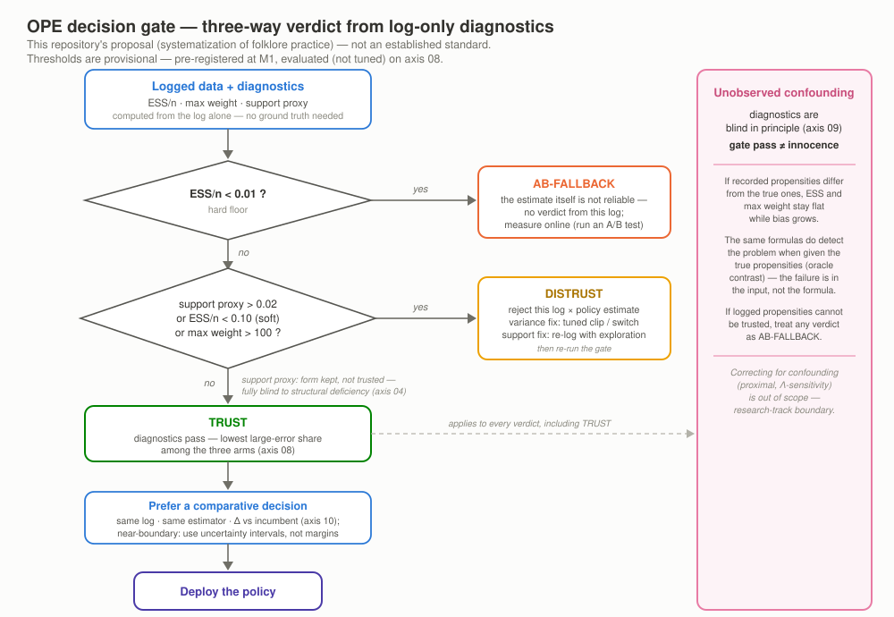

# PLAYBOOK — OPE decision gate 운영 플레이북 [제안]

> **지위 선언(프레임 고정).** 이 문서의 게이트 규칙·임계값은 **본 레포의 제안 — 문헌에 산발적으로만
> 존재하는 folklore 관행의 체계화 시도 — 이며 확립된 문헌 표준이 아니다** (ESS 관행의 산발성 근거:
> [Eligible Actions](https://arxiv.org/pdf/2207.00632); 선점 조사 전체는 [`POSITIONING.md`](POSITIONING.md)).
> 모든 실험 수치는 [`LEDGER.md`](LEDGER.md) 행 id 로만 인용한다(verbatim — 반올림·자작 금지).
> 용어는 [`GLOSSARY.md`](GLOSSARY.md) 정본을 따른다. 실행 코드는 `src/ope/diagnostics.py` 의
> `decision_gate`(판정)와 `PROVISIONAL_THRESHOLDS`(임계값)다.

*한 장 요약: 로그만으로 계산한 진단 3종이 3-way 판정으로 흐르고, `trust` 이후에도 비교형 결정을
우선하며(§4), 우측 경고 밴드가 전 판정에 걸리는 원리적 한계 — confounding blind(§6) — 를 상기시킨다.
KO twin SVG 는 M4 에서 제작한다.*

## 1. 목적 — 추정이 아니라 판정

OPE 의 실무 종착점은 "V̂(π_e) 가 얼마인가"가 아니라 **"이 추정을 지금 믿고 배포 결정에 써도 되는가"**다.
본 플레이북은 참값 없이 로그만으로 계산 가능한 진단 3종(ESS·max weight·support proxy —
`compute_diagnostics`)을 하나의 배포 게이트로 조립한다. 판정은 세 갈래다:

- **`trust`** — 추정을 결정에 사용한다(단 §4 비교형 우선 + §6 면책 병기).
- **`distrust`** — 이 로그 × 이 정책 조합의 추정을 기각하고 교정 경로(§2.1)로 보낸다.
- **`ab_fallback`** — 무엇을 믿을지 이전에 추정 자체가 불성립 — 온라인 A/B 테스트로 후퇴한다.

## 2. 게이트 규칙 — 3-way 판정

임계값은 `PROVISIONAL_THRESHOLDS` verbatim 이다. **잠정치**이며 축 08 실험으로만 정당화한다
(교정은 미실시 — §8; 일반 상수가 아니다).

| 판정 | 규칙(위에서 아래로 평가) | 잠정 임계값 |
|---|---|---|
| `ab_fallback` | ESS/n < hard floor → 즉시 반환(단락 — 아래 규칙은 보지 않음) | `ess_ratio_hard = 0.01` |
| `distrust` | support proxy 초과 **또는** ESS/n < soft floor **또는** max weight 초과 | `support_deficiency_max = 0.02` · `ess_ratio_soft = 0.10` · `max_weight_cap = 100.0` |
| `trust` | 위 어느 것도 위반하지 않음 | — |

**support proxy 정직 표기 — 형식 유지·신뢰 금지.** support proxy(전역 π̄_e 질량 중 로그 미등장 액션
비율)는 규칙의 형식으로는 유지하되 **신뢰해서는 안 된다**: 구조적(컨텍스트-국소) deficient support
에서 proxy 는 전면 blind 였다(`m2-04-proxy-blind`, §3). 축 08 grid 에서도 이 arm 은 한 번도 발화하지
않았다(`m2-08-forecast` 비고). proxy 통과는 support 무결의 근거가 못 된다.

### 2.1 `distrust` 교정 경로

- **분산측 문제**(soft ESS·max weight 위반): 튜닝된 clipping/switch 계열로 교정을 시도한다 —
  단 hyperparameter 는 §5 규율(SLOPE 또는 데이터 적응형 규칙)을 따른다. 교정 후 게이트 재실행.
- **support측 문제**: 추정단 교정이 없다(식별 불능 — 축 04). 처방은 로깅 정책의 탐색 확대 후
  **재로깅(re-log)** 뿐이다.

## 3. 근거 — LEDGER 행 인용

본 문서가 의존하는 실험 수치는 아래 4행이 전부이며, 전부 committed CSV 에서 등재된 verbatim 값이다.

| LEDGER 행 | 뒷받침하는 주장 | 수치(verbatim) |
|---|---|---|
| `m2-08-forecast` | 게이트 arm 별 실위험 분리 — 예보력 | share_large_err(=P(상대오차>0.10)): `trust` 0.045911191480811735 (n=19908) · `distrust` 0.1414141414141414 (n=396) · `ab_fallback` 0.4444444444444444 (n=36) · support arm 발화 0회 |
| `m2-09-blindspot` | confounding 하 진단 평평·bias 성장 + oracle 대조 | mean ESS/n(logged) 0.822986@γ=0 → 0.822315@γ=2.5 (사실상 평평) · bias(ips) −0.000147 → −0.056818 · oracle(pscore_true) ESS/n 0.8230 → 0.0182 |
| `m2-04-proxy-blind` | support proxy 의 전면 blind | proxy = 0.00000 (전 δ) vs oracle 참 미지지 π_e 질량 0.0227(δ=0.1) → 0.1434163(δ=0.4) |
| `m2-10-comparison` | 비교형 상쇄·혼합 bias 부활·경계 coin-flip | comparative gate(ε=0) false-go: weighting 계열(ips·snips·clipped) max = 0.0 (상쇄) · DM(혼합 비교) fg max = 0.15 / fs max = 0.375 (bias 부활) · DR-계열 boundary fg max = 0.225 (경계 coin-flip — 부분 상쇄) |

읽는 법: `trust` arm 의 대형 오차율은 `ab_fallback` arm 대비 한 자릿수(order of magnitude) 낮게
분리된다(원값은 위 행 verbatim — 파생 비율은 만들지 않는다) — 진단이
분산측 위험은 실제로 예보한다는 뜻이다(`m2-08-forecast`). 그러나 같은 진단이 confounding(축 09)과
구조적 support 결핍(축 04)에는 blind 다 — 게이트의 존재 이유와 한계가 같은 표에 있다.

## 4. 비교형 게이트 우선 원칙 (comparative-first)

**원칙: 절대 임계 게이트(V̂ > T)보다, 같은 로그 위에서 같은 estimator 로 후보와 incumbent 를 나란히
추정해 Δ 로 결정하는 비교형 게이트를 우선한다.** 공통 오차가 상쇄되기 때문이다(Δ-OPE 가 정식화 —
Jeunen+ RecSys'24, [arXiv:2405.10024](https://arxiv.org/abs/2405.10024)). 실증(`m2-10-comparison`):
weighting 계열(ips·snips·clipped)의 comparative false-go max = 0.0.

명시적 예외 두 가지(같은 행 verbatim):

- **혼합 비교 금지.** DM(후보) vs mean(r)(incumbent)처럼 서로 다른 추정기끼리 비교하면 상쇄가 깨져
  bias 가 결정 오류로 부활한다 — DM(혼합 비교) fg max = 0.15 / fs max = 0.375.
- **경계 근방은 상쇄로도 못 구한다.** 참값 차 ≈ 0 인 경계에서는 부분 상쇄가 있어도 판정이
  coin-flip 에 가깝다 — DR-계열 boundary fg max = 0.225. 경계 판정은 margin ε 이 아니라 **불확실성
  구간**으로 다룬다(합성 MC 축 = seed-ensemble band, 실데이터 = `bootstrap_ci`; CLAUDE.md §2 규약).

전제: 이 상쇄 논리는 γ=0(무 confounding) 위에 서 있다 — 전제가 깨지면 §6 이 우선한다.

## 5. Hyperparameter 규율 (축 07 — `m2-07-slope` 인용)

축 07(IEOE error-CDF; `results/figures/07_hyperparam_ieoe.png` ↔ `results/tables/07_hyperparam_ieoe.csv`)
의 수치 근거는 `m2-07-slope` 행 verbatim 이다(가혹 config β_log=8, |상대오차| 분위, CSV 재도출).
**미튜닝(random draw) clipped-IPS 는 tail 이 무겁다** — clipped random p90 = 0.12541997032257812.
SLOPE 선택은 이 tail 을 회복한다 — clipped slope p90 = 0.05030123684860422 (hyper-free 기준선
snips fixed p90 = 0.02908100554505259 병기). switch_dr 는 slope p50 = 0.005143399488432962 로
전 항목 최소다. **정직 병기**: dros 는 slope p50 = 0.009873919515252794 > random p50 =
0.00594413221900361 — 강규제 선택의 median 대가가 존재한다.

- **SLOPE 는 논문 방향 그대로 구현해야 한다**: ladder 는 광폭 CI(저편향 rung)부터 걷는다(Lepski 원리 —
  Su et al. ICML'20). M2 에서 방향 반전 구현이 실험으로 적발·수정된 이력이 있다(PLAN §4.2 — 반전은
  고편향 rung 의 veto 로 최소 rung 붕괴를 일으킨다; 회귀 테스트로 고정).
- **실무 규칙**: λ/τ 를 손으로 고르지 말 것. 데이터 적응형 규칙(`experiments/_common.py`
  `hyperparams_from_weights`: τ=p95(w) · λ_clip=p90(w) · λ_dros=p90(w)²) 또는 SLOPE 를 쓰고,
  선택값을 CSV 에 기록해 재현 가능하게 남긴다.

## 6. Confounding 면책 조항 (원리적 한계)

**게이트 통과는 무결의 증명이 아니다.** 로그에 기록되지 않은 변수 U 가 action 선택과 reward 에 동시
개입하면 기록 propensity ≠ 진짜 propensity 가 되고, 이때 진단은 원리적으로 blind 다 —
`m2-09-blindspot`: γ 0→2.5 에서 mean ESS/n(logged) 0.822986 → 0.822315 로 사실상 평평한 채
bias(ips) 는 −0.000147 → −0.056818 로 성장한다. 같은 진단 공식이 진짜 pscore(oracle)를 받으면
ESS/n 0.8230 → 0.0182 로 즉시 감지한다 — 문제는 공식이 아니라 **입력(기록 propensity)의 정직성**이다.

- **운영 함의**: 기록 propensity 를 신뢰할 수 없는 로그(수기 개입·규칙 오버라이드·미기록 개인화가
  의심되는 시스템)에서는 게이트 판정과 무관하게 `ab_fallback` 취급을 권고한다.
- **경계 재선언**: confounding 의 교정 본류(proximal 식별·Λ-sensitivity 등)는 연구 트랙
  (decision-frontier) 소관이다. 본 레포는 축 09 "진단이 못 보는 것" 대조표(+조건부 스트레치 축 14
  Λ-sweep)에서 **의도적으로 멈춘다** — 여기서 교정 방법을 주장하지 않는다.

## 7. 실데이터 검증 상태 (축 11–12 — 갱신 여지)

본 플레이북의 근거는 현재 **합성 축 01–10** 이다. 실데이터 이중 트랙 — 축 11(c2b 멀티데이터셋:
정확 propensity·정확 참값) · 축 12(OBD small: 실측 propensity·근사 GT — bootstrap CI 병기 필수,
PLAN §3.4) — 의 결과는 **M3 verify 후 LEDGER 신규 행을 경유해서만** 이 문서에 반영한다. 실데이터에서
게이트 임계값·규칙이 수정될 수 있음을 명시적 갱신 여지로 남긴다(수정 시 본 문서와 flowchart 동기화).

## 8. 한계·미주장 목록

1. **표준 아님** — 본 게이트는 folklore 체계화 시도이며, 문헌 합의 절차가 아니다(지위 선언).
2. **임계값은 잠정·국소** — `PROVISIONAL_THRESHOLDS` 는 M1 에서 folklore 로 사전 등록된 값이며,
   본 레포 합성 DGP family 의 축 08 grid 에서 **평가만** 되었다(무튜닝 — 교정은 seed-split 필요,
   M3+ 소관). 다른 도메인 이식은 재교정 없이는 무근거다.
3. **support proxy 는 형식 유지·신뢰 금지** — 구조적 결핍에 전면 blind(`m2-04-proxy-blind`).
4. **confounding 에 원리적 blind** — 게이트 통과 ≠ 무결(§6, `m2-09-blindspot`).
5. **축 10 상쇄 실증의 구조 한계** — q̂=αq+(1−α)/2 는 rank-보존 오지정이라 Spearman 만점을 상쇄
   효과만으로 과대해석하면 안 되고, 상쇄 논리 전체가 γ=0 전제다(`m2-10-comparison` 비고).
6. **실데이터 미검증** — 축 11–12 반영 전이며 §7 의 갱신 절차를 따른다. OBD 근사 GT 에 대한 점 비교
   단정은 금지한다(bootstrap CI 병기 — PLAN §3.4).
7. **범위 밖 미주장** — OPL/CATE/slate OPE/RL OPE, 그리고 proximal 등 confounding 교정 방법론에 대해
   본 문서는 어떤 주장도 하지 않는다(CLAUDE.md §1 비범위).
